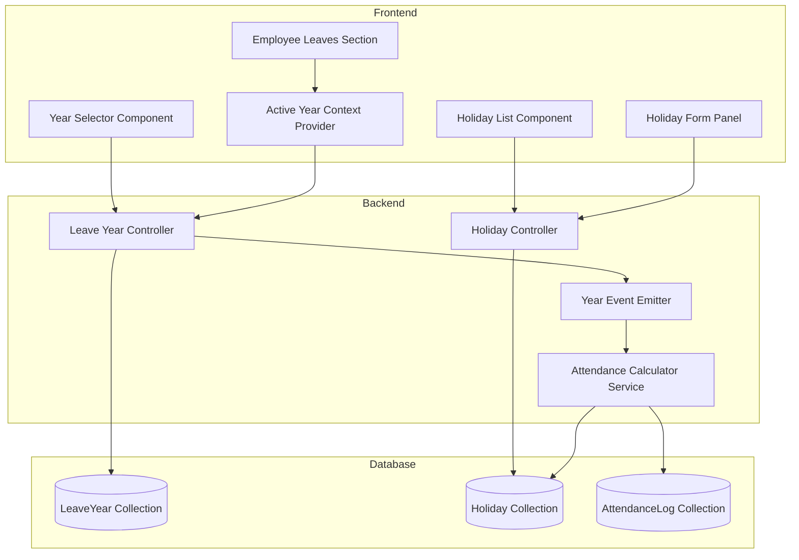
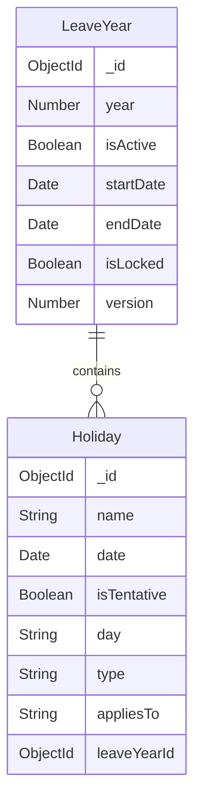

# Design Document: Holiday & Leave Year Management System

## Overview

The Holiday & Leave Year Management System transforms the existing basic holiday modal into an enterprise-grade system with proper yearly segregation, historical archiving, and clean hierarchical UI. This design addresses the need for multi-year holiday management while maintaining a single active operational context.

### System Goals

- Enable administrators to manage holidays across multiple leave years
- Enforce single active year constraint to maintain operational clarity
- Provide automatic synchronization of attendance calculations when active year changes
- Support historical data preservation through year archiving
- Deliver Apple-style UI with slide-over panels and segmented controls
- Enable bulk operations through Excel import/export

### Key Design Decisions

1. **Single Active Year Pattern**: Use database-level unique constraint on `isActive=true` to prevent dual active years
2. **Event-Driven Synchronization**: Implement event emitter pattern for active year changes to trigger recalculations
3. **Slide-Over UI Pattern**: Use right-side slide-over panels instead of modals to maintain page context
4. **Optimistic Locking**: Implement version-based locking for archived years to prevent accidental modifications
5. **Caching Strategy**: Cache active year data in memory with TTL-based invalidation

## Architecture

### System Components



### Technology Stack

- **Backend**: Node.js, Express.js, MongoDB with Mongoose ODM
- **Frontend**: React 18, Material-UI v5, React Context API
- **Excel Processing**: xlsx library (frontend and backend)
- **Event System**: Node.js EventEmitter
- **Caching**: In-memory cache with TTL (node-cache)

### Architectural Patterns

1. **Repository Pattern**: Separate data access logic from business logic
2. **Event-Driven Architecture**: Decouple active year changes from dependent systems
3. **Context Provider Pattern**: Manage active year state across React components
4. **Optimistic UI Updates**: Update UI immediately, rollback on server errors

## Components and Interfaces

### Backend Models

#### LeaveYear Model

```javascript
// backend/models/LeaveYear.js
const leaveYearSchema = new mongoose.Schema({
    year: {
        type: Number,
        required: true,
        unique: true,
        min: 2000,
        max: 2100
    },
    isActive: {
        type: Boolean,
        required: true,
        default: false
    },
    startDate: {
        type: Date,
        required: true
    },
    endDate: {
        type: Date,
        required: true,
        validate: {
            validator: function(value) {
                return value > this.startDate;
            },
            message: 'End date must be after start date'
        }
    },
    isLocked: {
        type: Boolean,
        default: false
    },
    version: {
        type: Number,
        default: 0
    }
}, { timestamps: true });

// Unique constraint: only one active year
leaveYearSchema.index({ isActive: 1 }, { 
    unique: true, 
    partialFilterExpression: { isActive: true }
});

// Pre-save hook to enforce single active year
leaveYearSchema.pre('save', async function(next) {
    if (this.isActive && this.isModified('isActive')) {
        const activeCount = await this.constructor.countDocuments({ 
            isActive: true, 
            _id: { $ne: this._id } 
        });
        if (activeCount > 0) {
            throw new Error('Another leave year is already active');
        }
    }
    next();
});
```

#### Updated Holiday Model

```javascript
// backend/models/Holiday.js (updated)
const holidaySchema = new mongoose.Schema({
    name: {
        type: String,
        required: true,
        trim: true,
        maxlength: 100
    },
    date: {
        type: Date,
        required: function() {
            return !this.isTentative;
        },
        default: null
    },
    isTentative: {
        type: Boolean,
        default: false
    },
    day: {
        type: String,
        trim: true
    },
    type: {
        type: String,
        enum: ['National', 'Regional', 'Company', 'Optional'],
        default: 'Company'
    },
    appliesTo: {
        type: String,
        enum: ['All', 'Department', 'Branch'],
        default: 'All'
    },
    leaveYearId: {
        type: mongoose.Schema.Types.ObjectId,
        ref: 'LeaveYear',
        required: true,
        index: true
    }
}, { timestamps: true });

// Compound index: unique date per leave year (only for non-tentative)
holidaySchema.index(
    { date: 1, leaveYearId: 1 }, 
    { 
        unique: true, 
        sparse: true,
        partialFilterExpression: { isTentative: false, date: { $ne: null } }
    }
);

// Index for efficient active year queries
holidaySchema.index({ leaveYearId: 1, date: 1 });
```

### Backend API Endpoints

#### Leave Year Endpoints

```
GET    /api/admin/leave-years              - List all leave years
POST   /api/admin/leave-years              - Create new leave year
GET    /api/admin/leave-years/:id          - Get specific leave year
PUT    /api/admin/leave-years/:id          - Update leave year
DELETE /api/admin/leave-years/:id          - Delete leave year (if not active)
POST   /api/admin/leave-years/:id/activate - Activate a leave year
POST   /api/admin/leave-years/:id/lock     - Lock/unlock archived year
POST   /api/admin/leave-years/:id/clone    - Clone holidays from another year
GET    /api/admin/leave-years/active       - Get current active year
```

#### Updated Holiday Endpoints

```
GET    /api/admin/holidays                      - List holidays (filtered by year)
POST   /api/admin/holidays                      - Create holiday
PUT    /api/admin/holidays/:id                  - Update holiday
DELETE /api/admin/holidays/:id                  - Delete holiday
POST   /api/admin/holidays/bulk-upload          - Bulk upload holidays
GET    /api/admin/holidays/export/:yearId       - Export holidays to Excel
PUT    /api/admin/holidays/:id/move             - Move holiday to another year

GET    /api/leaves/holidays                     - Employee endpoint (active year only)
```

#### Request/Response Schemas

**Create Leave Year**
```json
POST /api/admin/leave-years
{
  "year": 2025,
  "startDate": "2025-01-01",
  "endDate": "2025-12-31",
  "cloneFromYearId": "optional-year-id"
}

Response 201:
{
  "_id": "year-id",
  "year": 2025,
  "isActive": false,
  "startDate": "2025-01-01T00:00:00.000Z",
  "endDate": "2025-12-31T23:59:59.999Z",
  "isLocked": false,
  "version": 0,
  "createdAt": "2024-12-01T10:00:00.000Z"
}
```

**Activate Leave Year**
```json
POST /api/admin/leave-years/:id/activate
{
  "confirmDeactivateCurrent": true
}

Response 200:
{
  "message": "Leave year activated successfully",
  "previousActiveYear": "2024",
  "newActiveYear": "2025",
  "affectedSystems": ["attendance", "leaves"]
}
```

**Create Holiday**
```json
POST /api/admin/holidays
{
  "name": "Republic Day",
  "date": "2025-01-26",
  "day": "Sunday",
  "type": "National",
  "appliesTo": "All",
  "leaveYearId": "year-id",
  "isTentative": false
}

Response 201:
{
  "_id": "holiday-id",
  "name": "Republic Day",
  "date": "2025-01-26T00:00:00.000Z",
  "day": "Sunday",
  "type": "National",
  "appliesTo": "All",
  "leaveYearId": "year-id",
  "isTentative": false
}
```

### Frontend Components

#### ActiveYearContext

```javascript
// frontend/src/context/ActiveYearContext.jsx
import React, { createContext, useContext, useState, useEffect } from 'react';
import api from '../api/axios';

const ActiveYearContext = createContext();

export const ActiveYearProvider = ({ children }) => {
    const [activeYear, setActiveYear] = useState(null);
    const [loading, setLoading] = useState(true);
    const [error, setError] = useState(null);

    const fetchActiveYear = async () => {
        try {
            setLoading(true);
            const { data } = await api.get('/admin/leave-years/active');
            setActiveYear(data);
            setError(null);
        } catch (err) {
            setError(err.response?.data?.error || 'Failed to fetch active year');
            setActiveYear(null);
        } finally {
            setLoading(false);
        }
    };

    useEffect(() => {
        fetchActiveYear();
    }, []);

    const refreshActiveYear = () => {
        return fetchActiveYear();
    };

    return (
        <ActiveYearContext.Provider value={{ 
            activeYear, 
            loading, 
            error, 
            refreshActiveYear 
        }}>
            {children}
        </ActiveYearContext.Provider>
    );
};

export const useActiveYear = () => {
    const context = useContext(ActiveYearContext);
    if (!context) {
        throw new Error('useActiveYear must be used within ActiveYearProvider');
    }
    return context;
};
```

#### YearSelector Component

```javascript
// frontend/src/components/admin/YearSelector.jsx
import React from 'react';
import { Box, Button, Chip } from '@mui/material';
import AddIcon from '@mui/icons-material/Add';

const YearSelector = ({ years, selectedYear, onYearChange, onCreateNew }) => {
    return (
        <Box sx={{ 
            display: 'flex', 
            alignItems: 'center', 
            gap: 1,
            mb: 3,
            p: 1.5,
            bgcolor: 'white',
            borderRadius: '16px',
            border: '1px solid #e0e0e0'
        }}>
            {years.map(year => (
                <Chip
                    key={year._id}
                    label={year.year}
                    onClick={() => onYearChange(year)}
                    color={selectedYear?._id === year._id ? 'primary' : 'default'}
                    variant={selectedYear?._id === year._id ? 'filled' : 'outlined'}
                    icon={year.isActive ? <span>●</span> : null}
                    sx={{
                        fontSize: '16px',
                        fontWeight: selectedYear?._id === year._id ? 600 : 400,
                        transition: 'all 150ms ease',
                        '&:hover': {
                            transform: 'translateY(-2px)',
                            boxShadow: 1
                        }
                    }}
                />
            ))}
            <Button
                startIcon={<AddIcon />}
                onClick={onCreateNew}
                variant="outlined"
                size="small"
                sx={{ 
                    ml: 'auto',
                    borderRadius: '12px',
                    textTransform: 'none'
                }}
            >
                Create New Year
            </Button>
        </Box>
    );
};

export default YearSelector;
```

#### HolidayManagementPage Component

```javascript
// frontend/src/pages/admin/HolidayManagementPage.jsx
import React, { useState, useEffect } from 'react';
import { Box, Container, Typography, Button, Card, CardContent } from '@mui/material';
import YearSelector from '../../components/admin/YearSelector';
import HolidayList from '../../components/admin/HolidayList';
import HolidayFormPanel from '../../components/admin/HolidayFormPanel';
import YearOverviewCard from '../../components/admin/YearOverviewCard';
import api from '../../api/axios';

const HolidayManagementPage = () => {
    const [years, setYears] = useState([]);
    const [selectedYear, setSelectedYear] = useState(null);
    const [holidays, setHolidays] = useState([]);
    const [panelOpen, setPanelOpen] = useState(false);
    const [editingHoliday, setEditingHoliday] = useState(null);

    useEffect(() => {
        fetchYears();
    }, []);

    useEffect(() => {
        if (selectedYear) {
            fetchHolidays(selectedYear._id);
        }
    }, [selectedYear]);

    const fetchYears = async () => {
        const { data } = await api.get('/admin/leave-years');
        setYears(data);
        const active = data.find(y => y.isActive);
        setSelectedYear(active || data[0]);
    };

    const fetchHolidays = async (yearId) => {
        const { data } = await api.get(`/admin/holidays?yearId=${yearId}`);
        setHolidays(data);
    };

    return (
        <Container maxWidth="lg" sx={{ py: 4 }}>
            <Typography variant="h4" sx={{ mb: 3, fontWeight: 600 }}>
                Holiday & Leave Year Management
            </Typography>

            <YearSelector
                years={years}
                selectedYear={selectedYear}
                onYearChange={setSelectedYear}
                onCreateNew={() => {/* Open create year dialog */}}
            />

            {selectedYear && (
                <>
                    <YearOverviewCard year={selectedYear} holidays={holidays} />
                    <HolidayList
                        holidays={holidays}
                        onEdit={(holiday) => {
                            setEditingHoliday(holiday);
                            setPanelOpen(true);
                        }}
                        onDelete={(id) => {/* Delete logic */}}
                        onAdd={() => {
                            setEditingHoliday(null);
                            setPanelOpen(true);
                        }}
                    />
                </>
            )}

            <HolidayFormPanel
                open={panelOpen}
                onClose={() => setPanelOpen(false)}
                holiday={editingHoliday}
                yearId={selectedYear?._id}
                onSuccess={() => {
                    fetchHolidays(selectedYear._id);
                    setPanelOpen(false);
                }}
            />
        </Container>
    );
};

export default HolidayManagementPage;
```

#### HolidayFormPanel Component (Slide-Over)

```javascript
// frontend/src/components/admin/HolidayFormPanel.jsx
import React, { useState, useEffect } from 'react';
import { Drawer, Box, Typography, TextField, Button, MenuItem } from '@mui/material';
import CloseIcon from '@mui/icons-material/Close';
import api from '../../api/axios';

const HolidayFormPanel = ({ open, onClose, holiday, yearId, onSuccess }) => {
    const [formData, setFormData] = useState({
        name: '',
        date: '',
        day: '',
        type: 'Company',
        appliesTo: 'All',
        isTentative: false
    });

    useEffect(() => {
        if (holiday) {
            setFormData({
                name: holiday.name,
                date: holiday.date ? holiday.date.split('T')[0] : '',
                day: holiday.day || '',
                type: holiday.type || 'Company',
                appliesTo: holiday.appliesTo || 'All',
                isTentative: holiday.isTentative || false
            });
        } else {
            setFormData({
                name: '',
                date: '',
                day: '',
                type: 'Company',
                appliesTo: 'All',
                isTentative: false
            });
        }
    }, [holiday, open]);

    const handleSubmit = async (e) => {
        e.preventDefault();
        try {
            const payload = { ...formData, leaveYearId: yearId };
            if (holiday) {
                await api.put(`/admin/holidays/${holiday._id}`, payload);
            } else {
                await api.post('/admin/holidays', payload);
            }
            onSuccess();
        } catch (err) {
            console.error('Failed to save holiday:', err);
        }
    };

    return (
        <Drawer
            anchor="right"
            open={open}
            onClose={onClose}
            PaperProps={{
                sx: {
                    width: 480,
                    p: 3,
                    bgcolor: '#fafafa'
                }
            }}
        >
            <Box sx={{ display: 'flex', justifyContent: 'space-between', mb: 3 }}>
                <Typography variant="h6" sx={{ fontWeight: 600 }}>
                    {holiday ? 'Edit Holiday' : 'Add Holiday'}
                </Typography>
                <CloseIcon onClick={onClose} sx={{ cursor: 'pointer' }} />
            </Box>

            <form onSubmit={handleSubmit}>
                <TextField
                    fullWidth
                    label="Holiday Name"
                    value={formData.name}
                    onChange={(e) => setFormData({ ...formData, name: e.target.value })}
                    required
                    sx={{ mb: 2 }}
                />
                <TextField
                    fullWidth
                    label="Date"
                    type="date"
                    value={formData.date}
                    onChange={(e) => setFormData({ ...formData, date: e.target.value })}
                    InputLabelProps={{ shrink: true }}
                    required={!formData.isTentative}
                    sx={{ mb: 2 }}
                />
                <TextField
                    fullWidth
                    label="Day"
                    value={formData.day}
                    onChange={(e) => setFormData({ ...formData, day: e.target.value })}
                    sx={{ mb: 2 }}
                />
                <TextField
                    fullWidth
                    select
                    label="Type"
                    value={formData.type}
                    onChange={(e) => setFormData({ ...formData, type: e.target.value })}
                    sx={{ mb: 2 }}
                >
                    <MenuItem value="National">National</MenuItem>
                    <MenuItem value="Regional">Regional</MenuItem>
                    <MenuItem value="Company">Company</MenuItem>
                    <MenuItem value="Optional">Optional</MenuItem>
                </TextField>
                <TextField
                    fullWidth
                    select
                    label="Applies To"
                    value={formData.appliesTo}
                    onChange={(e) => setFormData({ ...formData, appliesTo: e.target.value })}
                    sx={{ mb: 3 }}
                >
                    <MenuItem value="All">All</MenuItem>
                    <MenuItem value="Department">Department</MenuItem>
                    <MenuItem value="Branch">Branch</MenuItem>
                </TextField>
                <Button
                    type="submit"
                    variant="contained"
                    fullWidth
                    sx={{ borderRadius: '12px', textTransform: 'none' }}
                >
                    {holiday ? 'Update Holiday' : 'Add Holiday'}
                </Button>
            </form>
        </Drawer>
    );
};

export default HolidayFormPanel;
```

## Data Models

### Database Schema

#### LeaveYear Collection

```javascript
{
  _id: ObjectId,
  year: Number,              // 2025
  isActive: Boolean,         // true (only one can be true)
  startDate: Date,           // 2025-01-01T00:00:00.000Z
  endDate: Date,             // 2025-12-31T23:59:59.999Z
  isLocked: Boolean,         // false (for archived years)
  version: Number,           // 0 (for optimistic locking)
  createdAt: Date,
  updatedAt: Date
}
```

**Indexes:**
- `{ year: 1 }` - unique
- `{ isActive: 1 }` - unique partial index where isActive = true
- `{ createdAt: -1 }` - for sorting

#### Holiday Collection (Updated)

```javascript
{
  _id: ObjectId,
  name: String,              // "Republic Day"
  date: Date,                // 2025-01-26T00:00:00.000Z (null if tentative)
  isTentative: Boolean,      // false
  day: String,               // "Sunday"
  type: String,              // "National" | "Regional" | "Company" | "Optional"
  appliesTo: String,         // "All" | "Department" | "Branch"
  leaveYearId: ObjectId,     // Reference to LeaveYear
  createdAt: Date,
  updatedAt: Date
}
```

**Indexes:**
- `{ leaveYearId: 1, date: 1 }` - for efficient queries
- `{ date: 1, leaveYearId: 1 }` - unique partial index (non-tentative only)
- `{ leaveYearId: 1 }` - for year-based filtering

### Data Relationships



### State Management

#### Active Year State (Frontend)

```javascript
// Global state managed by ActiveYearContext
{
  activeYear: {
    _id: "year-id",
    year: 2025,
    isActive: true,
    startDate: "2025-01-01T00:00:00.000Z",
    endDate: "2025-12-31T23:59:59.999Z",
    isLocked: false
  },
  loading: false,
  error: null
}
```

#### Cache Structure (Backend)

```javascript
// In-memory cache using node-cache
{
  "active-year": {
    value: { /* LeaveYear document */ },
    ttl: 3600 // 1 hour
  },
  "holidays:year-id": {
    value: [ /* Holiday documents */ ],
    ttl: 1800 // 30 minutes
  }
}
```

## Correctness Properties

*A property is a characteristic or behavior that should hold true across all valid executions of a system—essentially, a formal statement about what the system should do. Properties serve as the bridge between human-readable specifications and machine-verifiable correctness guarantees.*

### Property Reflection

After analyzing all acceptance criteria, I identified the following redundancies:
- Properties 2.1 and 2.2 both test single active year enforcement - combined into Property 1
- Properties 4.1 and 5.1 both test active year filtering - combined into Property 2
- Properties 11.2 and 11.3 both test cloning behavior - combined into Property 6
- Properties 13.1 and 13.2 test export content - combined into Property 10 (round-trip)
- Properties 15.3 and archiving behavior - covered by Property 12
- Properties 18.3 and 15.4 both test audit logging - combined into Property 13

### Property 1: Single Active Year Enforcement

*For any* set of leave years in the system, when an admin activates one leave year, exactly one leave year should have isActive = true, and all other leave years should have isActive = false.

**Validates: Requirements 2.1, 2.2, 18.1, 18.2**

### Property 2: Active Year Filtering

*For any* query for holidays or leave records, the system should return only data associated with the leave year where isActive = true.

**Validates: Requirements 4.1, 4.2, 5.1**

### Property 3: Date Range Validation

*For any* leave year, the startDate must be strictly before the endDate.

**Validates: Requirements 1.3**

### Property 4: Default Values on Creation

*For any* newly created leave year, the system should assign a unique identifier, set isActive to false by default, and record a creation timestamp.

**Validates: Requirements 1.2, 1.4**

### Property 5: Active Year Deletion Prevention

*For any* leave year where isActive = true, attempts to delete that leave year should be rejected with an error.

**Validates: Requirements 2.4**

### Property 6: Holiday Cloning Preserves Attributes

*For any* source leave year with holidays, when cloning to a new target year, all holidays should be copied with their type and applicability scope preserved, and dates adjusted to the target year.

**Validates: Requirements 11.2, 11.3**

### Property 7: Holiday Year Association

*For any* holiday created, the holiday must be associated with a specific leave year via leaveYearId.

**Validates: Requirements 3.4**

### Property 8: Active Year Change Triggers Synchronization

*For any* active year change, the system should emit an event and all dependent systems (attendance calculations, leave displays) should update to use the new active year's data.

**Validates: Requirements 4.4, 5.2, 20.1**

### Property 9: Locked Year Modification Prevention

*For any* archived leave year where isLocked = true, attempts to modify holidays associated with that year should be rejected with an error.

**Validates: Requirements 6.2**

### Property 10: Lock/Unlock Round Trip

*For any* archived leave year, locking then unlocking should restore the ability to modify holidays, and unlocking then locking should prevent modifications again.

**Validates: Requirements 6.3**

### Property 11: Holiday Sorting

*For any* list of holidays, when sorted by date, non-tentative holidays should appear in ascending date order, and tentative holidays should appear at the end sorted alphabetically by name.

**Validates: Requirements 9.4**

### Property 12: Holiday Count Aggregation

*For any* leave year with holidays, the total holiday count should equal the sum of all holidays, and type-specific counts (national, optional) should equal the count of holidays with that type.

**Validates: Requirements 8.1**

### Property 13: Holiday Validation

*For any* holiday submission, if required fields (name, date for non-tentative) are missing or invalid, the system should reject the submission with specific error messages.

**Validates: Requirements 10.3**

### Property 14: Bulk Import Validation

*For any* Excel file uploaded for bulk import, the system should validate all rows before importing, and if any row fails validation, the system should report specific errors with row numbers without importing any data.

**Validates: Requirements 12.2, 12.3**

### Property 15: Bulk Import Success

*For any* valid Excel file with holiday data, when imported, all holidays should be created and associated with the specified leave year.

**Validates: Requirements 12.4**

### Property 16: Export Round Trip

*For any* leave year with holidays, exporting to Excel then importing should produce an equivalent set of holidays with the same names, dates, types, and applicability scopes.

**Validates: Requirements 13.1, 13.2**

### Property 17: Export Filename Format

*For any* holiday export operation, the generated filename should match the format "Holidays_[Year]_[Timestamp].xlsx" where Year is the leave year number.

**Validates: Requirements 13.3**

### Property 18: Archive Prevention Without Replacement

*For any* system state where only one leave year exists, attempts to archive that year should be rejected with an error.

**Validates: Requirements 15.2**

### Property 19: Archiving Sets Flags

*For any* active leave year being archived, the system should set isActive to false and isLocked to true.

**Validates: Requirements 15.3**

### Property 20: Audit Logging

*For any* activation or archiving operation, the system should create an audit log entry with timestamp and admin identifier.

**Validates: Requirements 15.4, 18.3**

### Property 21: Year Selection Filtering

*For any* holiday move operation, the list of target years should exclude the holiday's current year.

**Validates: Requirements 19.2**

### Property 22: Holiday Move Updates Association

*For any* holiday moved to a different year, the leaveYearId should be updated to the target year, and all other attributes should remain unchanged.

**Validates: Requirements 19.3, 19.4**

### Property 23: Migration Preserves All Holidays

*For any* existing holiday set before migration, after migration all holidays should exist in the default leave year with their attributes preserved.

**Validates: Requirements 17.2**

## Error Handling

### Error Categories

#### Validation Errors (400 Bad Request)

```javascript
{
  error: "Validation failed",
  details: [
    { field: "startDate", message: "Start date must be before end date" },
    { field: "year", message: "Year must be between 2000 and 2100" }
  ]
}
```

**Scenarios:**
- Invalid date ranges (startDate >= endDate)
- Missing required fields (name, date for non-tentative holidays)
- Invalid enum values (type, appliesTo)
- Year out of range
- Invalid Excel file format

#### Constraint Violations (409 Conflict)

```javascript
{
  error: "Constraint violation",
  message: "Another leave year is already active",
  conflictingResource: { year: 2024, _id: "year-id" }
}
```

**Scenarios:**
- Attempting to activate a second year without deactivating the first
- Duplicate holiday date within the same year
- Duplicate year number

#### Authorization Errors (403 Forbidden)

```javascript
{
  error: "Forbidden",
  message: "Only administrators can manage leave years"
}
```

**Scenarios:**
- Non-admin attempting to create/modify leave years
- Non-admin attempting to activate/archive years
- Attempting to modify locked archived year

#### Not Found Errors (404 Not Found)

```javascript
{
  error: "Resource not found",
  message: "Leave year not found",
  resourceId: "year-id"
}
```

**Scenarios:**
- Requesting non-existent leave year
- Requesting non-existent holiday
- No active year exists when required

#### Business Logic Errors (422 Unprocessable Entity)

```javascript
{
  error: "Business rule violation",
  message: "Cannot delete active leave year",
  rule: "active_year_deletion_prevention"
}
```

**Scenarios:**
- Attempting to delete active leave year
- Attempting to archive the only leave year
- Attempting to modify holidays in locked year
- Attempting to move holiday to same year

### Error Handling Strategy

#### Backend Error Handling

```javascript
// backend/middleware/errorHandler.js
const errorHandler = (err, req, res, next) => {
    // Log error for monitoring
    console.error('[Error]', {
        timestamp: new Date().toISOString(),
        path: req.path,
        method: req.method,
        error: err.message,
        stack: process.env.NODE_ENV === 'development' ? err.stack : undefined
    });

    // Mongoose validation errors
    if (err.name === 'ValidationError') {
        return res.status(400).json({
            error: 'Validation failed',
            details: Object.values(err.errors).map(e => ({
                field: e.path,
                message: e.message
            }))
        });
    }

    // Mongoose duplicate key errors
    if (err.code === 11000) {
        const field = Object.keys(err.keyPattern)[0];
        return res.status(409).json({
            error: 'Duplicate value',
            field: field,
            message: `A record with this ${field} already exists`
        });
    }

    // Custom business logic errors
    if (err.name === 'BusinessRuleError') {
        return res.status(422).json({
            error: 'Business rule violation',
            message: err.message,
            rule: err.rule
        });
    }

    // Default server error
    res.status(err.status || 500).json({
        error: err.message || 'Internal server error'
    });
};

module.exports = errorHandler;
```

#### Frontend Error Handling

```javascript
// frontend/src/utils/errorHandler.js
export const handleApiError = (error, showSnackbar) => {
    if (error.response) {
        const { status, data } = error.response;
        
        switch (status) {
            case 400:
                showSnackbar(
                    data.details 
                        ? data.details.map(d => d.message).join(', ')
                        : data.message || 'Invalid input',
                    'error'
                );
                break;
            case 403:
                showSnackbar('You do not have permission to perform this action', 'error');
                break;
            case 404:
                showSnackbar(data.message || 'Resource not found', 'error');
                break;
            case 409:
                showSnackbar(data.message || 'Conflict detected', 'warning');
                break;
            case 422:
                showSnackbar(data.message || 'Business rule violation', 'warning');
                break;
            default:
                showSnackbar('An unexpected error occurred', 'error');
        }
    } else if (error.request) {
        showSnackbar('Network error. Please check your connection.', 'error');
    } else {
        showSnackbar('An error occurred', 'error');
    }
};
```

### Rollback Strategy

#### Database Transaction Rollback

```javascript
// For operations that modify multiple collections
const session = await mongoose.startSession();
session.startTransaction();

try {
    // Deactivate current active year
    await LeaveYear.updateMany(
        { isActive: true },
        { isActive: false },
        { session }
    );
    
    // Activate new year
    await LeaveYear.findByIdAndUpdate(
        newYearId,
        { isActive: true },
        { session }
    );
    
    await session.commitTransaction();
} catch (error) {
    await session.abortTransaction();
    throw error;
} finally {
    session.endSession();
}
```

#### Frontend Optimistic Update Rollback

```javascript
// Optimistically update UI, rollback on error
const handleActivateYear = async (yearId) => {
    const previousState = [...years];
    
    // Optimistic update
    setYears(years.map(y => ({
        ...y,
        isActive: y._id === yearId
    })));
    
    try {
        await api.post(`/admin/leave-years/${yearId}/activate`);
    } catch (error) {
        // Rollback on error
        setYears(previousState);
        handleApiError(error, showSnackbar);
    }
};
```

## Testing Strategy

### Dual Testing Approach

This feature requires both unit tests and property-based tests for comprehensive coverage:

- **Unit tests**: Verify specific examples, edge cases, and error conditions
- **Property tests**: Verify universal properties across all inputs

Unit tests focus on concrete scenarios and integration points, while property tests handle comprehensive input coverage through randomization. Together, they provide complete validation of both specific behaviors and general correctness.

### Property-Based Testing

#### Library Selection

- **Backend**: Use `fast-check` for Node.js property-based testing
- **Frontend**: Use `fast-check` for React component property testing

#### Configuration

Each property test must:
- Run minimum 100 iterations (due to randomization)
- Reference its design document property in a comment tag
- Use format: `// Feature: holiday-leave-year-management, Property {number}: {property_text}`

#### Property Test Examples

**Property 1: Single Active Year Enforcement**

```javascript
// Feature: holiday-leave-year-management, Property 1: Single active year enforcement
const fc = require('fast-check');
const LeaveYear = require('../models/LeaveYear');

describe('Property 1: Single Active Year Enforcement', () => {
    it('should ensure exactly one active year after activation', async () => {
        await fc.assert(
            fc.asyncProperty(
                fc.array(fc.integer({ min: 2020, max: 2030 }), { minLength: 2, maxLength: 5 }),
                async (years) => {
                    // Setup: Create multiple leave years
                    const createdYears = await Promise.all(
                        years.map(year => LeaveYear.create({
                            year,
                            startDate: new Date(year, 0, 1),
                            endDate: new Date(year, 11, 31),
                            isActive: false
                        }))
                    );

                    // Action: Activate one year
                    const yearToActivate = createdYears[0];
                    yearToActivate.isActive = true;
                    await yearToActivate.save();

                    // Verification: Exactly one active year
                    const activeYears = await LeaveYear.find({ isActive: true });
                    expect(activeYears).toHaveLength(1);
                    expect(activeYears[0]._id.toString()).toBe(yearToActivate._id.toString());

                    // Cleanup
                    await LeaveYear.deleteMany({ _id: { $in: createdYears.map(y => y._id) } });
                }
            ),
            { numRuns: 100 }
        );
    });
});
```

**Property 2: Active Year Filtering**

```javascript
// Feature: holiday-leave-year-management, Property 2: Active year filtering
describe('Property 2: Active Year Filtering', () => {
    it('should return only holidays from active year', async () => {
        await fc.assert(
            fc.asyncProperty(
                fc.record({
                    activeYear: fc.integer({ min: 2020, max: 2030 }),
                    inactiveYear: fc.integer({ min: 2020, max: 2030 }),
                    holidayCount: fc.integer({ min: 1, max: 10 })
                }),
                async ({ activeYear, inactiveYear, holidayCount }) => {
                    fc.pre(activeYear !== inactiveYear);

                    // Setup: Create two years
                    const activeYearDoc = await LeaveYear.create({
                        year: activeYear,
                        startDate: new Date(activeYear, 0, 1),
                        endDate: new Date(activeYear, 11, 31),
                        isActive: true
                    });

                    const inactiveYearDoc = await LeaveYear.create({
                        year: inactiveYear,
                        startDate: new Date(inactiveYear, 0, 1),
                        endDate: new Date(inactiveYear, 11, 31),
                        isActive: false
                    });

                    // Create holidays for both years
                    const activeHolidays = await Promise.all(
                        Array.from({ length: holidayCount }, (_, i) => 
                            Holiday.create({
                                name: `Active Holiday ${i}`,
                                date: new Date(activeYear, i, 1),
                                leaveYearId: activeYearDoc._id
                            })
                        )
                    );

                    await Promise.all(
                        Array.from({ length: holidayCount }, (_, i) => 
                            Holiday.create({
                                name: `Inactive Holiday ${i}`,
                                date: new Date(inactiveYear, i, 1),
                                leaveYearId: inactiveYearDoc._id
                            })
                        )
                    );

                    // Action: Query holidays for active year
                    const activeYearData = await LeaveYear.findOne({ isActive: true });
                    const filteredHolidays = await Holiday.find({ 
                        leaveYearId: activeYearData._id 
                    });

                    // Verification: Only active year holidays returned
                    expect(filteredHolidays).toHaveLength(holidayCount);
                    filteredHolidays.forEach(holiday => {
                        expect(holiday.leaveYearId.toString()).toBe(activeYearDoc._id.toString());
                    });

                    // Cleanup
                    await LeaveYear.deleteMany({ _id: { $in: [activeYearDoc._id, inactiveYearDoc._id] } });
                    await Holiday.deleteMany({ leaveYearId: { $in: [activeYearDoc._id, inactiveYearDoc._id] } });
                }
            ),
            { numRuns: 100 }
        );
    });
});
```

**Property 6: Holiday Cloning Preserves Attributes**

```javascript
// Feature: holiday-leave-year-management, Property 6: Holiday cloning preserves attributes
describe('Property 6: Holiday Cloning Preserves Attributes', () => {
    it('should preserve type and scope when cloning holidays', async () => {
        await fc.assert(
            fc.asyncProperty(
                fc.record({
                    sourceYear: fc.integer({ min: 2020, max: 2025 }),
                    targetYear: fc.integer({ min: 2026, max: 2030 }),
                    holidays: fc.array(
                        fc.record({
                            name: fc.string({ minLength: 1, maxLength: 50 }),
                            month: fc.integer({ min: 0, max: 11 }),
                            day: fc.integer({ min: 1, max: 28 }),
                            type: fc.constantFrom('National', 'Regional', 'Company', 'Optional'),
                            appliesTo: fc.constantFrom('All', 'Department', 'Branch')
                        }),
                        { minLength: 1, maxLength: 10 }
                    )
                }),
                async ({ sourceYear, targetYear, holidays }) => {
                    // Setup: Create source year with holidays
                    const sourceYearDoc = await LeaveYear.create({
                        year: sourceYear,
                        startDate: new Date(sourceYear, 0, 1),
                        endDate: new Date(sourceYear, 11, 31),
                        isActive: false
                    });

                    const sourceHolidays = await Promise.all(
                        holidays.map(h => Holiday.create({
                            name: h.name,
                            date: new Date(sourceYear, h.month, h.day),
                            type: h.type,
                            appliesTo: h.appliesTo,
                            leaveYearId: sourceYearDoc._id
                        }))
                    );

                    // Action: Clone to target year
                    const targetYearDoc = await LeaveYear.create({
                        year: targetYear,
                        startDate: new Date(targetYear, 0, 1),
                        endDate: new Date(targetYear, 11, 31),
                        isActive: false
                    });

                    const clonedHolidays = await Promise.all(
                        sourceHolidays.map(h => {
                            const newDate = new Date(h.date);
                            newDate.setFullYear(targetYear);
                            return Holiday.create({
                                name: h.name,
                                date: newDate,
                                type: h.type,
                                appliesTo: h.appliesTo,
                                leaveYearId: targetYearDoc._id
                            });
                        })
                    );

                    // Verification: Attributes preserved, dates adjusted
                    expect(clonedHolidays).toHaveLength(sourceHolidays.length);
                    clonedHolidays.forEach((cloned, i) => {
                        const source = sourceHolidays[i];
                        expect(cloned.name).toBe(source.name);
                        expect(cloned.type).toBe(source.type);
                        expect(cloned.appliesTo).toBe(source.appliesTo);
                        expect(cloned.date.getFullYear()).toBe(targetYear);
                        expect(cloned.date.getMonth()).toBe(source.date.getMonth());
                        expect(cloned.date.getDate()).toBe(source.date.getDate());
                    });

                    // Cleanup
                    await LeaveYear.deleteMany({ _id: { $in: [sourceYearDoc._id, targetYearDoc._id] } });
                    await Holiday.deleteMany({ leaveYearId: { $in: [sourceYearDoc._id, targetYearDoc._id] } });
                }
            ),
            { numRuns: 100 }
        );
    });
});
```

### Unit Testing

#### Backend Unit Tests

**Leave Year Controller Tests**

```javascript
describe('LeaveYear Controller', () => {
    describe('POST /api/admin/leave-years', () => {
        it('should create a new leave year with default isActive=false', async () => {
            const response = await request(app)
                .post('/api/admin/leave-years')
                .set('Authorization', `Bearer ${adminToken}`)
                .send({
                    year: 2025,
                    startDate: '2025-01-01',
                    endDate: '2025-12-31'
                });

            expect(response.status).toBe(201);
            expect(response.body.isActive).toBe(false);
            expect(response.body.year).toBe(2025);
        });

        it('should reject creation with invalid date range', async () => {
            const response = await request(app)
                .post('/api/admin/leave-years')
                .set('Authorization', `Bearer ${adminToken}`)
                .send({
                    year: 2025,
                    startDate: '2025-12-31',
                    endDate: '2025-01-01'
                });

            expect(response.status).toBe(400);
            expect(response.body.error).toContain('End date must be after start date');
        });

        it('should reject duplicate year', async () => {
            await LeaveYear.create({
                year: 2025,
                startDate: new Date(2025, 0, 1),
                endDate: new Date(2025, 11, 31)
            });

            const response = await request(app)
                .post('/api/admin/leave-years')
                .set('Authorization', `Bearer ${adminToken}`)
                .send({
                    year: 2025,
                    startDate: '2025-01-01',
                    endDate: '2025-12-31'
                });

            expect(response.status).toBe(409);
        });
    });

    describe('POST /api/admin/leave-years/:id/activate', () => {
        it('should activate year and deactivate others', async () => {
            const year1 = await LeaveYear.create({
                year: 2024,
                startDate: new Date(2024, 0, 1),
                endDate: new Date(2024, 11, 31),
                isActive: true
            });

            const year2 = await LeaveYear.create({
                year: 2025,
                startDate: new Date(2025, 0, 1),
                endDate: new Date(2025, 11, 31),
                isActive: false
            });

            const response = await request(app)
                .post(`/api/admin/leave-years/${year2._id}/activate`)
                .set('Authorization', `Bearer ${adminToken}`)
                .send({ confirmDeactivateCurrent: true });

            expect(response.status).toBe(200);

            const updatedYear1 = await LeaveYear.findById(year1._id);
            const updatedYear2 = await LeaveYear.findById(year2._id);

            expect(updatedYear1.isActive).toBe(false);
            expect(updatedYear2.isActive).toBe(true);
        });
    });

    describe('DELETE /api/admin/leave-years/:id', () => {
        it('should prevent deletion of active year', async () => {
            const activeYear = await LeaveYear.create({
                year: 2025,
                startDate: new Date(2025, 0, 1),
                endDate: new Date(2025, 11, 31),
                isActive: true
            });

            const response = await request(app)
                .delete(`/api/admin/leave-years/${activeYear._id}`)
                .set('Authorization', `Bearer ${adminToken}`);

            expect(response.status).toBe(422);
            expect(response.body.message).toContain('Cannot delete active leave year');
        });

        it('should allow deletion of inactive year', async () => {
            const inactiveYear = await LeaveYear.create({
                year: 2023,
                startDate: new Date(2023, 0, 1),
                endDate: new Date(2023, 11, 31),
                isActive: false
            });

            const response = await request(app)
                .delete(`/api/admin/leave-years/${inactiveYear._id}`)
                .set('Authorization', `Bearer ${adminToken}`);

            expect(response.status).toBe(204);

            const deletedYear = await LeaveYear.findById(inactiveYear._id);
            expect(deletedYear).toBeNull();
        });
    });
});
```

**Holiday Controller Tests**

```javascript
describe('Holiday Controller', () => {
    let testYear;

    beforeEach(async () => {
        testYear = await LeaveYear.create({
            year: 2025,
            startDate: new Date(2025, 0, 1),
            endDate: new Date(2025, 11, 31),
            isActive: true
        });
    });

    describe('POST /api/admin/holidays', () => {
        it('should create holiday with year association', async () => {
            const response = await request(app)
                .post('/api/admin/holidays')
                .set('Authorization', `Bearer ${adminToken}`)
                .send({
                    name: 'Republic Day',
                    date: '2025-01-26',
                    type: 'National',
                    appliesTo: 'All',
                    leaveYearId: testYear._id
                });

            expect(response.status).toBe(201);
            expect(response.body.leaveYearId).toBe(testYear._id.toString());
        });

        it('should reject holiday without required fields', async () => {
            const response = await request(app)
                .post('/api/admin/holidays')
                .set('Authorization', `Bearer ${adminToken}`)
                .send({
                    date: '2025-01-26',
                    leaveYearId: testYear._id
                });

            expect(response.status).toBe(400);
        });

        it('should prevent duplicate date in same year', async () => {
            await Holiday.create({
                name: 'Holiday 1',
                date: new Date(2025, 0, 26),
                leaveYearId: testYear._id
            });

            const response = await request(app)
                .post('/api/admin/holidays')
                .set('Authorization', `Bearer ${adminToken}`)
                .send({
                    name: 'Holiday 2',
                    date: '2025-01-26',
                    leaveYearId: testYear._id
                });

            expect(response.status).toBe(409);
        });
    });

    describe('PUT /api/admin/holidays/:id/move', () => {
        it('should move holiday to different year', async () => {
            const targetYear = await LeaveYear.create({
                year: 2026,
                startDate: new Date(2026, 0, 1),
                endDate: new Date(2026, 11, 31),
                isActive: false
            });

            const holiday = await Holiday.create({
                name: 'Test Holiday',
                date: new Date(2025, 0, 26),
                type: 'Company',
                appliesTo: 'All',
                leaveYearId: testYear._id
            });

            const response = await request(app)
                .put(`/api/admin/holidays/${holiday._id}/move`)
                .set('Authorization', `Bearer ${adminToken}`)
                .send({ targetYearId: targetYear._id });

            expect(response.status).toBe(200);

            const movedHoliday = await Holiday.findById(holiday._id);
            expect(movedHoliday.leaveYearId.toString()).toBe(targetYear._id.toString());
            expect(movedHoliday.name).toBe('Test Holiday');
            expect(movedHoliday.type).toBe('Company');
        });
    });
});
```

#### Frontend Unit Tests

**YearSelector Component Tests**

```javascript
import { render, screen, fireEvent } from '@testing-library/react';
import YearSelector from '../components/admin/YearSelector';

describe('YearSelector Component', () => {
    const mockYears = [
        { _id: '1', year: 2024, isActive: false },
        { _id: '2', year: 2025, isActive: true },
        { _id: '3', year: 2026, isActive: false }
    ];

    it('should highlight active year', () => {
        render(
            <YearSelector
                years={mockYears}
                selectedYear={mockYears[1]}
                onYearChange={jest.fn()}
                onCreateNew={jest.fn()}
            />
        );

        const activeChip = screen.getByText('2025');
        expect(activeChip).toHaveClass('MuiChip-filled');
    });

    it('should call onYearChange when year is clicked', () => {
        const handleYearChange = jest.fn();
        render(
            <YearSelector
                years={mockYears}
                selectedYear={mockYears[1]}
                onYearChange={handleYearChange}
                onCreateNew={jest.fn()}
            />
        );

        fireEvent.click(screen.getByText('2024'));
        expect(handleYearChange).toHaveBeenCalledWith(mockYears[0]);
    });

    it('should call onCreateNew when create button is clicked', () => {
        const handleCreateNew = jest.fn();
        render(
            <YearSelector
                years={mockYears}
                selectedYear={mockYears[1]}
                onYearChange={jest.fn()}
                onCreateNew={handleCreateNew}
            />
        );

        fireEvent.click(screen.getByText('Create New Year'));
        expect(handleCreateNew).toHaveBeenCalled();
    });
});
```

**ActiveYearContext Tests**

```javascript
import { renderHook, waitFor } from '@testing-library/react';
import { ActiveYearProvider, useActiveYear } from '../context/ActiveYearContext';
import api from '../api/axios';

jest.mock('../api/axios');

describe('ActiveYearContext', () => {
    it('should fetch active year on mount', async () => {
        const mockActiveYear = {
            _id: '1',
            year: 2025,
            isActive: true,
            startDate: '2025-01-01',
            endDate: '2025-12-31'
        };

        api.get.mockResolvedValue({ data: mockActiveYear });

        const { result } = renderHook(() => useActiveYear(), {
            wrapper: ActiveYearProvider
        });

        await waitFor(() => {
            expect(result.current.loading).toBe(false);
        });

        expect(result.current.activeYear).toEqual(mockActiveYear);
        expect(result.current.error).toBeNull();
    });

    it('should handle fetch error', async () => {
        api.get.mockRejectedValue({
            response: { data: { error: 'No active year found' } }
        });

        const { result } = renderHook(() => useActiveYear(), {
            wrapper: ActiveYearProvider
        });

        await waitFor(() => {
            expect(result.current.loading).toBe(false);
        });

        expect(result.current.activeYear).toBeNull();
        expect(result.current.error).toBe('No active year found');
    });
});
```

### Integration Testing

#### Event System Integration

```javascript
describe('Active Year Change Event Integration', () => {
    it('should trigger attendance recalculation on year activation', async () => {
        const year2024 = await LeaveYear.create({
            year: 2024,
            startDate: new Date(2024, 0, 1),
            endDate: new Date(2024, 11, 31),
            isActive: true
        });

        const year2025 = await LeaveYear.create({
            year: 2025,
            startDate: new Date(2025, 0, 1),
            endDate: new Date(2025, 11, 31),
            isActive: false
        });

        // Mock event listener
        const recalculationSpy = jest.fn();
        yearEventEmitter.on('activeYearChanged', recalculationSpy);

        // Activate new year
        await request(app)
            .post(`/api/admin/leave-years/${year2025._id}/activate`)
            .set('Authorization', `Bearer ${adminToken}`)
            .send({ confirmDeactivateCurrent: true });

        expect(recalculationSpy).toHaveBeenCalledWith({
            previousYear: 2024,
            newYear: 2025
        });
    });
});
```

### Test Coverage Goals

- **Backend**: Minimum 85% code coverage
- **Frontend**: Minimum 80% code coverage
- **Property Tests**: All 23 properties must have corresponding tests
- **Unit Tests**: All API endpoints must have success and error case tests
- **Integration Tests**: All event-driven workflows must be tested

### Continuous Integration

```yaml
# .github/workflows/test.yml
name: Test Suite

on: [push, pull_request]

jobs:
  test:
    runs-on: ubuntu-latest
    steps:
      - uses: actions/checkout@v2
      - uses: actions/setup-node@v2
        with:
          node-version: '18'
      
      - name: Install dependencies
        run: |
          cd backend && npm install
          cd ../frontend && npm install
      
      - name: Run backend tests
        run: cd backend && npm test -- --coverage
      
      - name: Run frontend tests
        run: cd frontend && npm test -- --coverage
      
      - name: Run property tests
        run: cd backend && npm run test:properties
      
      - name: Upload coverage
        uses: codecov/codecov-action@v2
```

## Migration Strategy

### Phase 1: Database Schema Migration

#### Step 1: Create LeaveYear Collection

```javascript
// backend/migrations/001_create_leave_year.js
const mongoose = require('mongoose');
const LeaveYear = require('../models/LeaveYear');

async function up() {
    console.log('Creating default leave year...');
    
    const currentYear = new Date().getFullYear();
    
    const defaultYear = await LeaveYear.create({
        year: currentYear,
        startDate: new Date(currentYear, 0, 1),
        endDate: new Date(currentYear, 11, 31, 23, 59, 59),
        isActive: true,
        isLocked: false
    });
    
    console.log(`Created default leave year: ${currentYear}`);
    return defaultYear;
}

async function down() {
    console.log('Removing leave years...');
    await LeaveYear.deleteMany({});
}

module.exports = { up, down };
```

#### Step 2: Add leaveYearId to Holidays

```javascript
// backend/migrations/002_add_leave_year_to_holidays.js
const mongoose = require('mongoose');
const Holiday = require('../models/Holiday');
const LeaveYear = require('../models/LeaveYear');

async function up() {
    console.log('Migrating holidays to default leave year...');
    
    // Get the active leave year (created in previous migration)
    const activeYear = await LeaveYear.findOne({ isActive: true });
    
    if (!activeYear) {
        throw new Error('No active leave year found. Run migration 001 first.');
    }
    
    // Update all existing holidays to reference the active year
    const result = await Holiday.updateMany(
        { leaveYearId: { $exists: false } },
        { $set: { leaveYearId: activeYear._id } }
    );
    
    console.log(`Migrated ${result.modifiedCount} holidays to year ${activeYear.year}`);
    
    // Create index
    await Holiday.collection.createIndex(
        { leaveYearId: 1, date: 1 }
    );
    
    console.log('Created index on leaveYearId and date');
}

async function down() {
    console.log('Removing leaveYearId from holidays...');
    await Holiday.updateMany(
        {},
        { $unset: { leaveYearId: '' } }
    );
    
    await Holiday.collection.dropIndex('leaveYearId_1_date_1');
}

module.exports = { up, down };
```

### Phase 2: Backend API Updates

#### Step 1: Update Holiday Queries

```javascript
// Before migration
const holidays = await Holiday.find({ isTentative: false });

// After migration
const activeYear = await LeaveYear.findOne({ isActive: true });
const holidays = await Holiday.find({ 
    leaveYearId: activeYear._id,
    isTentative: false 
});
```

#### Step 2: Create Active Year Cache Service

```javascript
// backend/services/activeYearCache.js
const NodeCache = require('node-cache');
const LeaveYear = require('../models/LeaveYear');

class ActiveYearCache {
    constructor() {
        this.cache = new NodeCache({ stdTTL: 3600 }); // 1 hour TTL
    }

    async getActiveYear() {
        const cached = this.cache.get('active-year');
        if (cached) {
            return cached;
        }

        const activeYear = await LeaveYear.findOne({ isActive: true });
        if (activeYear) {
            this.cache.set('active-year', activeYear);
        }
        return activeYear;
    }

    invalidate() {
        this.cache.del('active-year');
    }
}

module.exports = new ActiveYearCache();
```

#### Step 3: Update Attendance Calculation Service

```javascript
// backend/services/attendanceCalculator.js (updated)
const activeYearCache = require('./activeYearCache');

async function getWorkingDatesForMonth(month, year, employee) {
    const activeYear = await activeYearCache.getActiveYear();
    
    if (!activeYear) {
        throw new Error('No active leave year configured');
    }
    
    const monthStart = new Date(year, month, 1);
    const monthEnd = new Date(year, month + 1, 0, 23, 59, 59, 999);
    
    const holidays = await Holiday.find({
        leaveYearId: activeYear._id,
        date: { $gte: monthStart, $lte: monthEnd, $ne: null },
        isTentative: { $ne: true }
    }).lean();
    
    // ... rest of calculation logic
}
```

### Phase 3: Frontend Updates

#### Step 1: Add ActiveYearContext to App

```javascript
// frontend/src/App.jsx (updated)
import { ActiveYearProvider } from './context/ActiveYearContext';

function App() {
    return (
        <AuthProvider>
            <ActiveYearProvider>
                <ThemeProvider theme={theme}>
                    <Router>
                        {/* Routes */}
                    </Router>
                </ThemeProvider>
            </ActiveYearProvider>
        </AuthProvider>
    );
}
```

#### Step 2: Update Holiday Display Components

```javascript
// frontend/src/components/HolidayCalendar.jsx (updated)
import { useActiveYear } from '../context/ActiveYearContext';

const HolidayCalendar = () => {
    const { activeYear, loading, error } = useActiveYear();
    const [holidays, setHolidays] = useState([]);

    useEffect(() => {
        if (activeYear) {
            fetchHolidays();
        }
    }, [activeYear]);

    const fetchHolidays = async () => {
        const { data } = await api.get('/leaves/holidays');
        setHolidays(data);
    };

    if (loading) return <Skeleton />;
    if (error) return <Alert severity="error">{error}</Alert>;
    if (!activeYear) return <Alert severity="warning">No active year configured</Alert>;

    return (
        <Box>
            <Typography variant="caption">
                Showing holidays for {activeYear.year}
            </Typography>
            {/* Holiday display */}
        </Box>
    );
};
```

### Phase 4: Event System Implementation

#### Backend Event Emitter

```javascript
// backend/services/yearEventEmitter.js
const EventEmitter = require('events');

class YearEventEmitter extends EventEmitter {
    emitActiveYearChanged(previousYear, newYear) {
        this.emit('activeYearChanged', {
            previousYear,
            newYear,
            timestamp: new Date()
        });
    }
}

module.exports = new YearEventEmitter();
```

#### Event Listeners

```javascript
// backend/services/attendanceSync.js
const yearEventEmitter = require('./yearEventEmitter');
const activeYearCache = require('./activeYearCache');

yearEventEmitter.on('activeYearChanged', async ({ previousYear, newYear }) => {
    console.log(`Active year changed from ${previousYear} to ${newYear}`);
    
    // Invalidate cache
    activeYearCache.invalidate();
    
    // Trigger recalculation (if needed)
    // await recalculateAttendanceMetrics();
    
    console.log('Attendance system synchronized with new active year');
});
```

### Phase 5: Deployment Checklist

1. **Pre-Deployment**
   - [ ] Backup production database
   - [ ] Test migrations on staging environment
   - [ ] Verify all existing holidays have valid dates
   - [ ] Review and test rollback procedures

2. **Deployment**
   - [ ] Run database migrations
   - [ ] Deploy backend with new API endpoints
   - [ ] Deploy frontend with new components
   - [ ] Verify active year is set correctly
   - [ ] Test holiday filtering in employee views

3. **Post-Deployment**
   - [ ] Monitor error logs for migration issues
   - [ ] Verify attendance calculations use active year
   - [ ] Test admin holiday management workflows
   - [ ] Confirm event system is working
   - [ ] Update API documentation

4. **Rollback Plan**
   - [ ] Database migration rollback scripts ready
   - [ ] Previous backend version tagged
   - [ ] Previous frontend build available
   - [ ] Communication plan for users

### Migration Timeline

- **Week 1**: Database schema changes and migrations
- **Week 2**: Backend API implementation and testing
- **Week 3**: Frontend component development
- **Week 4**: Integration testing and bug fixes
- **Week 5**: Staging deployment and user acceptance testing
- **Week 6**: Production deployment and monitoring

## Security Considerations

### Authorization

- Only users with `isAdmin` or `isHR` roles can manage leave years
- Only admins can activate/archive years
- Employees can only view holidays from active year
- Locked years require explicit unlock action before modification

### Data Validation

- Server-side validation for all inputs
- Date range validation (startDate < endDate)
- Year range validation (2000-2100)
- Holiday name length validation (max 100 characters)
- Excel file size limit (5MB)
- Excel file type validation

### Audit Logging

```javascript
// Log all critical operations
const auditLog = {
    action: 'ACTIVATE_YEAR',
    userId: req.user._id,
    userName: req.user.name,
    timestamp: new Date(),
    details: {
        previousActiveYear: 2024,
        newActiveYear: 2025
    },
    ipAddress: req.ip
};

await SystemAuditLog.create(auditLog);
```

### Rate Limiting

```javascript
// Prevent abuse of bulk operations
const rateLimit = require('express-rate-limit');

const bulkUploadLimiter = rateLimit({
    windowMs: 15 * 60 * 1000, // 15 minutes
    max: 5, // 5 requests per window
    message: 'Too many bulk upload requests, please try again later'
});

router.post('/holidays/bulk-upload', 
    [authenticateToken, isAdminOrHr, bulkUploadLimiter],
    bulkUploadHandler
);
```

## Performance Optimization

### Database Indexing

```javascript
// Optimized indexes for common queries
LeaveYear.collection.createIndex({ isActive: 1 });
LeaveYear.collection.createIndex({ year: 1 }, { unique: true });
Holiday.collection.createIndex({ leaveYearId: 1, date: 1 });
Holiday.collection.createIndex({ leaveYearId: 1, type: 1 });
```

### Caching Strategy

- Active year cached for 1 hour
- Holiday lists cached for 30 minutes per year
- Cache invalidation on year activation
- Cache invalidation on holiday CRUD operations

### Query Optimization

```javascript
// Use lean() for read-only queries
const holidays = await Holiday.find({ leaveYearId: activeYear._id })
    .lean()
    .select('name date type appliesTo');

// Use projection to limit fields
const years = await LeaveYear.find()
    .select('year isActive startDate endDate')
    .sort({ year: -1 });
```

### Frontend Optimization

- Lazy load holiday management page
- Virtualize long holiday lists
- Debounce search inputs
- Memoize expensive computations
- Use React.memo for static components

## Monitoring and Observability

### Metrics to Track

- Active year query response time
- Holiday filter query performance
- Bulk upload success/failure rate
- Year activation frequency
- Cache hit/miss ratio

### Logging

```javascript
// Structured logging for operations
logger.info('Year activated', {
    operation: 'ACTIVATE_YEAR',
    yearId: year._id,
    year: year.year,
    previousActiveYear: previousYear,
    duration: Date.now() - startTime,
    userId: req.user._id
});
```

### Alerts

- Alert when no active year exists
- Alert on repeated activation failures
- Alert on bulk upload failures
- Alert on cache invalidation errors
- Alert on event emission failures

## Future Enhancements

1. **Multi-Region Support**: Different holiday sets per office location
2. **Holiday Templates**: Pre-defined holiday sets for different countries
3. **Approval Workflow**: Require approval before year activation
4. **Holiday Notifications**: Notify employees of upcoming holidays
5. **Calendar Integration**: Export holidays to Google Calendar/Outlook
6. **Historical Analytics**: Track holiday usage patterns over years
7. **Automated Year Creation**: Auto-create next year based on current year
8. **Holiday Suggestions**: AI-powered holiday date suggestions based on patterns
