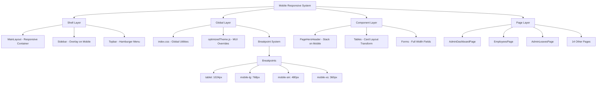
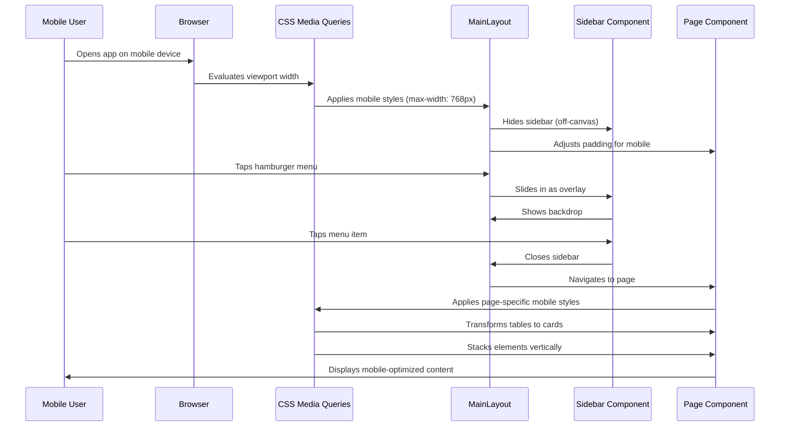

# Design Document: Mobile Responsive UI

## Overview

The Attendance Management System currently has a desktop-first UI that breaks completely on mobile screens. This design implements a comprehensive mobile-responsive solution that transforms the application into a mobile-friendly experience while preserving the existing desktop layout. The solution uses CSS media queries, MUI theme overrides, and component-level responsive patterns to ensure the application works seamlessly across all device sizes (desktop ≥900px, tablets 768-1024px, mobile 360-768px).

The design follows a strict constraint: desktop layout must remain unchanged. All responsive modifications use additive-only CSS with max-width media queries, ensuring zero visual regression on desktop screens.

## Architecture



## Main Algorithm/Workflow



## Components and Interfaces

### Component 1: MainLayout (Responsive Container)

**Purpose**: Manages the overall layout structure and adapts spacing/padding for mobile devices

**Interface**:
```typescript
interface MainLayoutProps {
  children?: React.ReactNode;
}

interface MainLayoutState {
  isMobileMenuOpen: boolean;
  viewportWidth: number;
}

// CSS Variables
interface LayoutCSSVariables {
  '--sidebar-width': string;        // Desktop: 70px, Mobile: 0px
  '--topbar-height': string;         // Desktop: 56px, Mobile: 56px
  '--main-content-padding': string;  // Desktop: 88px 32px 32px, Mobile: 72px 16px 16px
}
```

**Responsibilities**:
- Detect viewport size and apply appropriate layout mode
- Manage mobile menu open/close state
- Adjust main content padding based on screen size
- Coordinate with Sidebar for overlay behavior

### Component 2: Sidebar (Overlay Navigation)

**Purpose**: Transforms from fixed sidebar to mobile overlay menu with hamburger toggle

**Interface**:
```typescript
interface SidebarProps {
  onNotificationClick: () => void;
  isMobileMenuOpen?: boolean;
  onMobileMenuClose?: () => void;
}

interface SidebarState {
  isOverlayMode: boolean;  // true when viewport < 768px
}

// CSS Classes
interface SidebarCSSClasses {
  'sidebar': string;                    // Base sidebar
  'sidebar--mobile': string;            // Mobile overlay mode
  'sidebar--open': string;              // Mobile menu open state
  'sidebar-backdrop': string;           // Dark overlay behind sidebar
}
```

**Responsibilities**:
- Render as fixed sidebar on desktop (≥768px)
- Transform to off-canvas overlay on mobile (<768px)
- Provide hamburger menu button in Topbar
- Close on backdrop click or menu item selection
- Maintain 44px minimum touch targets

### Component 3: Topbar (Mobile Header)

**Purpose**: Adapts header for mobile with hamburger menu and responsive actions

**Interface**:
```typescript
interface TopbarProps {
  onNotificationClick: () => void;
  onMobileMenuToggle?: () => void;
  isMobileMenuOpen?: boolean;
}

interface TopbarState {
  isMobileView: boolean;  // true when viewport < 768px
}

// Mobile-specific elements
interface TopbarMobileElements {
  hamburgerButton: React.ReactNode;  // Shows only on mobile
  logo: React.ReactNode;             // Smaller on mobile
  actions: React.ReactNode;          // Condensed on mobile
}
```

**Responsibilities**:
- Show hamburger menu button on mobile
- Adjust logo size for mobile
- Condense action buttons on small screens
- Maintain fixed position across all breakpoints

### Component 4: PageHeroHeader (Responsive Page Header)

**Purpose**: Stacks title, description, and actions vertically on mobile

**Interface**:
```typescript
interface PageHeroHeaderProps {
  eyebrow?: string;
  title: string;
  description?: string;
  icon?: React.ReactNode;
  actionArea?: React.ReactNode;
}

// Responsive behavior
interface PageHeroHeaderResponsive {
  desktop: {
    layout: 'horizontal';
    titlePosition: 'left';
    actionsPosition: 'right';
  };
  mobile: {
    layout: 'vertical';
    titlePosition: 'top';
    actionsPosition: 'bottom';
    spacing: '16px';
  };
}
```

**Responsibilities**:
- Stack elements vertically on mobile
- Adjust font sizes for mobile readability
- Ensure action buttons are full-width on mobile
- Maintain proper spacing between elements

### Component 5: Table to Card Transformer

**Purpose**: Converts desktop table layouts to mobile card layouts using CSS

**Interface**:
```typescript
// CSS-based transformation (no JS interface)
interface TableCardTransform {
  desktop: {
    display: 'grid' | 'table';
    columns: number;
  };
  mobile: {
    display: 'block';
    cardLayout: true;
    dataLabels: boolean;  // Show column labels in each card
  };
}

// Data attribute pattern
interface TableCellAttributes {
  'data-label': string;  // Column name for mobile display
}
```

**Responsibilities**:
- Hide table headers on mobile
- Transform rows into cards
- Display column labels inline with data
- Maintain proper spacing and borders
- Ensure touch-friendly interaction areas

## Data Models

### Model 1: Breakpoint Configuration

```typescript
interface BreakpointConfig {
  tablet: {
    maxWidth: '1024px';
    description: 'Tablets and small laptops';
  };
  mobileLg: {
    maxWidth: '768px';
    description: 'Most phones and small tablets';
  };
  mobileSm: {
    maxWidth: '480px';
    description: 'Small phones';
  };
  mobileXs: {
    maxWidth: '360px';
    description: 'Very small phones';
  };
}
```

**Validation Rules**:
- All breakpoints use max-width (not min-width)
- Breakpoints must be in descending order
- Desktop styles have no media query wrapper

### Model 2: Mobile Menu State

```typescript
interface MobileMenuState {
  isOpen: boolean;
  hasBackdrop: boolean;
  animationDuration: number;  // milliseconds
  closeOnNavigation: boolean;
  closeOnBackdropClick: boolean;
}

// Default values
const defaultMobileMenuState: MobileMenuState = {
  isOpen: false,
  hasBackdrop: true,
  animationDuration: 300,
  closeOnNavigation: true,
  closeOnBackdropClick: true,
};
```

**Validation Rules**:
- isOpen must be boolean
- animationDuration must be 200-500ms
- Backdrop must be present when menu is open

### Model 3: Touch Target Configuration

```typescript
interface TouchTargetConfig {
  minHeight: '44px';
  minWidth: '44px';
  padding: '12px';
  tapHighlight: 'rgba(0, 0, 0, 0.1)';
}

// Applied to all interactive elements on mobile
const mobileInteractiveElements = [
  'button',
  'a',
  '.sidebar-link',
  '.MuiIconButton-root',
  '.MuiButton-root',
  'input[type="checkbox"]',
  'input[type="radio"]',
];
```

**Validation Rules**:
- All interactive elements must meet 44px minimum
- Touch targets must have visible tap feedback
- Spacing between targets must be ≥8px

## Algorithmic Pseudocode

### Main Responsive Layout Algorithm

```typescript
ALGORITHM applyResponsiveLayout(viewportWidth: number): void
INPUT: viewportWidth (current browser viewport width in pixels)
OUTPUT: None (applies CSS classes and state changes)

PRECONDITIONS:
  - viewportWidth is a positive number
  - DOM is fully loaded
  - CSS media queries are defined

POSTCONDITIONS:
  - Correct layout mode is applied
  - Mobile menu state is initialized if needed
  - All components reflect current breakpoint

BEGIN
  // Determine breakpoint
  IF viewportWidth <= 360 THEN
    currentBreakpoint ← 'mobile-xs'
  ELSE IF viewportWidth <= 480 THEN
    currentBreakpoint ← 'mobile-sm'
  ELSE IF viewportWidth <= 768 THEN
    currentBreakpoint ← 'mobile-lg'
  ELSE IF viewportWidth <= 1024 THEN
    currentBreakpoint ← 'tablet'
  ELSE
    currentBreakpoint ← 'desktop'
  END IF
  
  // Apply layout mode
  IF currentBreakpoint IN ['mobile-xs', 'mobile-sm', 'mobile-lg'] THEN
    layoutMode ← 'mobile'
    sidebarMode ← 'overlay'
    mainContentPadding ← '72px 16px 16px'
    showHamburgerMenu ← true
  ELSE IF currentBreakpoint = 'tablet' THEN
    layoutMode ← 'tablet'
    sidebarMode ← 'fixed'
    mainContentPadding ← '80px 24px 24px'
    showHamburgerMenu ← false
  ELSE
    layoutMode ← 'desktop'
    sidebarMode ← 'fixed'
    mainContentPadding ← '88px 32px 32px'
    showHamburgerMenu ← false
  END IF
  
  // Update DOM
  document.body.setAttribute('data-layout-mode', layoutMode)
  document.body.setAttribute('data-breakpoint', currentBreakpoint)
  
  // Initialize mobile menu state if needed
  IF layoutMode = 'mobile' AND mobileMenuState = null THEN
    mobileMenuState ← {
      isOpen: false,
      hasBackdrop: true,
      animationDuration: 300,
      closeOnNavigation: true,
      closeOnBackdropClick: true
    }
  END IF
  
  ASSERT layoutMode IN ['mobile', 'tablet', 'desktop']
  ASSERT sidebarMode IN ['overlay', 'fixed']
END
```

### Mobile Menu Toggle Algorithm

```typescript
ALGORITHM toggleMobileMenu(currentState: boolean): void
INPUT: currentState (current open/closed state of mobile menu)
OUTPUT: None (updates menu state and applies animations)

PRECONDITIONS:
  - layoutMode = 'mobile'
  - mobileMenuState is initialized
  - Sidebar component is mounted

POSTCONDITIONS:
  - Menu state is toggled
  - Appropriate animations are applied
  - Backdrop visibility is updated
  - Body scroll is locked/unlocked

BEGIN
  newState ← NOT currentState
  
  IF newState = true THEN
    // Opening menu
    sidebar.classList.add('sidebar--open')
    backdrop.classList.add('backdrop--visible')
    document.body.style.overflow ← 'hidden'  // Prevent background scroll
    
    // Animate sidebar slide-in
    sidebar.style.transform ← 'translateX(0)'
    sidebar.style.transition ← 'transform 300ms ease-out'
    
    // Animate backdrop fade-in
    backdrop.style.opacity ← '1'
    backdrop.style.transition ← 'opacity 300ms ease-out'
  ELSE
    // Closing menu
    sidebar.classList.remove('sidebar--open')
    backdrop.classList.remove('backdrop--visible')
    document.body.style.overflow ← ''  // Restore scroll
    
    // Animate sidebar slide-out
    sidebar.style.transform ← 'translateX(-100%)'
    sidebar.style.transition ← 'transform 300ms ease-in'
    
    // Animate backdrop fade-out
    backdrop.style.opacity ← '0'
    backdrop.style.transition ← 'opacity 300ms ease-in'
    
    // Remove backdrop after animation
    setTimeout(() => {
      backdrop.style.display ← 'none'
    }, 300)
  END IF
  
  mobileMenuState.isOpen ← newState
  
  ASSERT mobileMenuState.isOpen = newState
  ASSERT (newState = true) IMPLIES (document.body.style.overflow = 'hidden')
END
```

### Table to Card Transform Algorithm

```typescript
ALGORITHM transformTableToCards(tableElement: HTMLElement, breakpoint: string): void
INPUT: tableElement (DOM element of table), breakpoint (current breakpoint name)
OUTPUT: None (applies CSS transformations)

PRECONDITIONS:
  - tableElement is a valid table or grid element
  - breakpoint is one of ['mobile-xs', 'mobile-sm', 'mobile-lg', 'tablet', 'desktop']
  - All table cells have data-label attributes

POSTCONDITIONS:
  - Table displays as cards on mobile
  - Table displays as grid/table on desktop
  - All data remains accessible
  - Touch targets meet 44px minimum

BEGIN
  IF breakpoint IN ['mobile-xs', 'mobile-sm', 'mobile-lg'] THEN
    // Mobile card layout
    tableElement.classList.add('table--mobile-cards')
    
    // Hide table header
    tableHeader ← tableElement.querySelector('.table-header')
    IF tableHeader EXISTS THEN
      tableHeader.style.display ← 'none'
    END IF
    
    // Transform each row to card
    rows ← tableElement.querySelectorAll('.table-row')
    FOR EACH row IN rows DO
      row.classList.add('table-row--card')
      row.style.display ← 'block'
      row.style.marginBottom ← '16px'
      row.style.padding ← '16px'
      row.style.border ← '1px solid #e0e0e0'
      row.style.borderRadius ← '8px'
      
      // Transform each cell
      cells ← row.querySelectorAll('.table-cell')
      FOR EACH cell IN cells DO
        cell.classList.add('table-cell--mobile')
        cell.style.display ← 'flex'
        cell.style.justifyContent ← 'space-between'
        cell.style.marginBottom ← '8px'
        cell.style.minHeight ← '44px'  // Touch target
        
        // Show data label
        label ← cell.getAttribute('data-label')
        IF label EXISTS THEN
          cell.insertAdjacentHTML('afterbegin', 
            `<span class="cell-label">${label}:</span>`)
        END IF
      END FOR
    END FOR
  ELSE
    // Desktop table layout (remove mobile classes if present)
    tableElement.classList.remove('table--mobile-cards')
    
    // Show table header
    tableHeader ← tableElement.querySelector('.table-header')
    IF tableHeader EXISTS THEN
      tableHeader.style.display ← ''
    END IF
    
    // Reset rows and cells to default
    rows ← tableElement.querySelectorAll('.table-row')
    FOR EACH row IN rows DO
      row.classList.remove('table-row--card')
      row.style.display ← ''
      row.style.marginBottom ← ''
      row.style.padding ← ''
      row.style.border ← ''
      row.style.borderRadius ← ''
      
      cells ← row.querySelectorAll('.table-cell')
      FOR EACH cell IN cells DO
        cell.classList.remove('table-cell--mobile')
        cell.style.display ← ''
        cell.style.justifyContent ← ''
        cell.style.marginBottom ← ''
        cell.style.minHeight ← ''
        
        // Remove data label if present
        labelElement ← cell.querySelector('.cell-label')
        IF labelElement EXISTS THEN
          labelElement.remove()
        END IF
      END FOR
    END FOR
  END IF
  
  ASSERT (breakpoint IN ['mobile-xs', 'mobile-sm', 'mobile-lg']) 
         IMPLIES tableElement.classList.contains('table--mobile-cards')
END
```

### Viewport Resize Handler Algorithm

```typescript
ALGORITHM handleViewportResize(): void
INPUT: None (triggered by window resize event)
OUTPUT: None (updates layout based on new viewport size)

PRECONDITIONS:
  - Window resize event has fired
  - Debounce timer is set (150ms)

POSTCONDITIONS:
  - Layout is updated to match new viewport
  - Mobile menu is closed if switching to desktop
  - All components reflect new breakpoint

BEGIN
  // Debounce resize events
  clearTimeout(resizeTimer)
  resizeTimer ← setTimeout(() => {
    currentWidth ← window.innerWidth
    previousBreakpoint ← currentBreakpoint
    
    // Determine new breakpoint
    applyResponsiveLayout(currentWidth)
    
    // Handle breakpoint transitions
    IF previousBreakpoint IN ['mobile-xs', 'mobile-sm', 'mobile-lg'] 
       AND currentBreakpoint NOT IN ['mobile-xs', 'mobile-sm', 'mobile-lg'] THEN
      // Transitioning from mobile to tablet/desktop
      IF mobileMenuState.isOpen = true THEN
        toggleMobileMenu(true)  // Close mobile menu
      END IF
      
      // Reset mobile-specific styles
      document.body.style.overflow ← ''
      sidebar.style.transform ← ''
      backdrop.style.display ← 'none'
    END IF
    
    IF previousBreakpoint NOT IN ['mobile-xs', 'mobile-sm', 'mobile-lg']
       AND currentBreakpoint IN ['mobile-xs', 'mobile-sm', 'mobile-lg'] THEN
      // Transitioning from tablet/desktop to mobile
      // Initialize mobile menu state
      IF mobileMenuState = null THEN
        mobileMenuState ← defaultMobileMenuState
      END IF
    END IF
    
    // Trigger re-render of responsive components
    dispatchEvent(new CustomEvent('breakpoint-change', {
      detail: { 
        previous: previousBreakpoint, 
        current: currentBreakpoint 
      }
    }))
  }, 150)
  
  ASSERT resizeTimer IS SET
END
```

## Key Functions with Formal Specifications

### Function 1: useMobileDetection()

```typescript
function useMobileDetection(): {
  isMobile: boolean;
  isTablet: boolean;
  isDesktop: boolean;
  breakpoint: string;
}
```

**Preconditions:**
- Hook is called within a React component
- Window object is available (client-side only)

**Postconditions:**
- Returns current device type flags
- Returns current breakpoint name
- Updates on window resize
- Cleans up event listeners on unmount

**Loop Invariants:** N/A (no loops)

### Function 2: toggleMobileMenu()

```typescript
function toggleMobileMenu(isOpen: boolean): void
```

**Preconditions:**
- Component is in mobile layout mode (viewport < 768px)
- Sidebar component is mounted in DOM
- Backdrop element exists

**Postconditions:**
- Menu state is updated to `isOpen` value
- Sidebar slides in/out with 300ms animation
- Backdrop fades in/out with 300ms animation
- Body scroll is locked when menu is open
- Body scroll is restored when menu is closed

**Loop Invariants:** N/A (no loops)

### Function 3: applyMobileStyles()

```typescript
function applyMobileStyles(element: HTMLElement, breakpoint: string): void
```

**Preconditions:**
- `element` is a valid DOM element
- `breakpoint` is one of ['mobile-xs', 'mobile-sm', 'mobile-lg', 'tablet', 'desktop']

**Postconditions:**
- Appropriate CSS classes are added to element
- Mobile-specific styles are applied if breakpoint is mobile
- Desktop styles are preserved if breakpoint is desktop/tablet
- No existing desktop styles are modified

**Loop Invariants:** 
- For style application loops: All previously processed elements maintain their styles

## Example Usage

```typescript
// Example 1: Using mobile detection hook in a component
import { useMobileDetection } from '../hooks/useMobileDetection';

function MyComponent() {
  const { isMobile, isTablet, breakpoint } = useMobileDetection();
  
  return (
    <div className={`component ${isMobile ? 'component--mobile' : ''}`}>
      {isMobile ? (
        <MobileLayout />
      ) : (
        <DesktopLayout />
      )}
      <p>Current breakpoint: {breakpoint}</p>
    </div>
  );
}

// Example 2: Mobile menu toggle in MainLayout
function MainLayout() {
  const [isMobileMenuOpen, setIsMobileMenuOpen] = useState(false);
  const { isMobile } = useMobileDetection();
  
  const handleMenuToggle = () => {
    setIsMobileMenuOpen(prev => !prev);
  };
  
  return (
    <div className="app-container">
      <Topbar 
        onMobileMenuToggle={handleMenuToggle}
        isMobileMenuOpen={isMobileMenuOpen}
      />
      <Sidebar 
        isMobileMenuOpen={isMobileMenuOpen}
        onMobileMenuClose={() => setIsMobileMenuOpen(false)}
      />
      <main className="main-content">
        <Outlet />
      </main>
      {isMobile && isMobileMenuOpen && (
        <div 
          className="sidebar-backdrop"
          onClick={() => setIsMobileMenuOpen(false)}
        />
      )}
    </div>
  );
}

// Example 3: Responsive table with data-label attributes
function EmployeesTable({ employees }) {
  return (
    <div className="employee-grid-table">
      <div className="employee-grid-header">
        <div className="grid-cell">Employee ID</div>
        <div className="grid-cell">Name</div>
        <div className="grid-cell">Role</div>
      </div>
      <div className="employee-grid-body">
        {employees.map(emp => (
          <div className="employee-grid-row" key={emp.id}>
            <div className="grid-cell" data-label="Employee ID">
              {emp.employeeCode}
            </div>
            <div className="grid-cell" data-label="Name">
              {emp.fullName}
            </div>
            <div className="grid-cell" data-label="Role">
              {emp.role}
            </div>
          </div>
        ))}
      </div>
    </div>
  );
}

// Example 4: Mobile-responsive CSS with media queries
const styles = `
  /* Desktop styles (no media query) */
  .main-content {
    margin-left: 70px;
    padding: 88px 32px 32px;
  }
  
  /* Tablet styles */
  @media (max-width: 1024px) {
    .main-content {
      padding: 80px 24px 24px;
    }
  }
  
  /* Mobile styles */
  @media (max-width: 768px) {
    .main-content {
      margin-left: 0;
      padding: 72px 16px 16px;
    }
    
    .sidebar {
      position: fixed;
      left: -280px;
      transition: left 300ms ease-out;
    }
    
    .sidebar--open {
      left: 0;
    }
  }
`;
```

## Correctness Properties

### Property 1: Desktop Layout Preservation
```typescript
// Universal quantification: For all viewport widths >= 900px,
// the desktop layout must remain visually identical to the original
∀ viewportWidth ≥ 900px:
  currentLayout(viewportWidth) === originalDesktopLayout
```

### Property 2: Mobile Menu Accessibility
```typescript
// All interactive elements on mobile must meet WCAG touch target size
∀ element ∈ mobileInteractiveElements:
  element.minHeight >= 44px AND element.minWidth >= 44px
```

### Property 3: Responsive Breakpoint Consistency
```typescript
// Breakpoint transitions must be smooth and consistent
∀ breakpoint ∈ ['mobile-xs', 'mobile-sm', 'mobile-lg', 'tablet', 'desktop']:
  applyResponsiveLayout(breakpoint) IMPLIES
    (layoutMode IS CONSISTENT WITH breakpoint) AND
    (NO DESKTOP STYLES ARE MODIFIED)
```

### Property 4: Mobile Menu State Integrity
```typescript
// Mobile menu state must be consistent with UI
∀ time t:
  (mobileMenuState.isOpen = true) ⟺ 
    (sidebar.classList.contains('sidebar--open') AND
     backdrop.style.display !== 'none' AND
     document.body.style.overflow = 'hidden')
```

### Property 5: Table Card Transform Reversibility
```typescript
// Table transformations must be fully reversible
∀ table ∈ tables:
  transformTableToCards(table, 'mobile-lg') THEN
  transformTableToCards(table, 'desktop') IMPLIES
    table.structure === originalTableStructure
```

## Error Handling

### Error Scenario 1: Viewport Resize During Animation

**Condition**: User resizes browser window while mobile menu is animating
**Response**: 
- Cancel current animation using `clearTimeout()`
- Immediately apply new breakpoint styles
- Reset menu state to closed if transitioning to desktop
**Recovery**: 
- Re-initialize layout with new viewport dimensions
- Clear any pending animation timers
- Ensure no orphaned event listeners

### Error Scenario 2: Missing data-label Attributes

**Condition**: Table cells lack `data-label` attributes for mobile card layout
**Response**:
- Log warning to console in development mode
- Fall back to displaying cell content without label
- Apply generic "Data" label as fallback
**Recovery**:
- Provide developer tools to detect missing labels
- Add ESLint rule to enforce data-label attributes
- Document requirement in component guidelines

### Error Scenario 3: CSS Media Query Not Supported

**Condition**: Browser doesn't support CSS media queries (very old browsers)
**Response**:
- Detect support using `window.matchMedia`
- Fall back to desktop layout if unsupported
- Display warning message to user
**Recovery**:
- Provide polyfill for matchMedia if needed
- Suggest browser upgrade to user
- Ensure core functionality remains accessible

### Error Scenario 4: Mobile Menu Stuck Open

**Condition**: Menu remains open after navigation or backdrop click fails
**Response**:
- Implement escape key handler to force close
- Add timeout to auto-close after 30 seconds of inactivity
- Provide visible close button as fallback
**Recovery**:
- Reset menu state on page navigation
- Clear all menu-related styles and classes
- Restore body scroll immediately

## Testing Strategy

### Unit Testing Approach

Test individual responsive components in isolation using React Testing Library and Jest.

**Key Test Cases**:
1. **useMobileDetection Hook**
   - Returns correct breakpoint for various viewport widths
   - Updates on window resize events
   - Cleans up event listeners on unmount

2. **toggleMobileMenu Function**
   - Opens menu with correct animations
   - Closes menu and restores scroll
   - Handles rapid toggle clicks

3. **Table Card Transform**
   - Transforms table to cards on mobile breakpoint
   - Reverses transformation on desktop breakpoint
   - Preserves all data during transformation

4. **Responsive CSS Classes**
   - Applies correct classes for each breakpoint
   - Removes classes when breakpoint changes
   - Never modifies desktop-targeted rules

**Coverage Goals**: 90% code coverage for responsive logic, 100% for critical layout functions

### Property-Based Testing Approach

Use property-based testing to verify responsive behavior across random viewport sizes and state combinations.

**Property Test Library**: fast-check (for TypeScript/JavaScript)

**Properties to Test**:
1. **Breakpoint Consistency**: For any viewport width, the applied breakpoint matches the defined ranges
2. **Layout Preservation**: Desktop layout remains unchanged for all widths ≥ 900px
3. **Touch Target Size**: All interactive elements meet 44px minimum on mobile
4. **Menu State Integrity**: Menu state always matches UI state (open/closed)
5. **Transform Reversibility**: Table transformations are fully reversible

**Example Property Test**:
```typescript
import fc from 'fast-check';

test('breakpoint detection is consistent', () => {
  fc.assert(
    fc.property(
      fc.integer({ min: 320, max: 2560 }), // Random viewport width
      (viewportWidth) => {
        const breakpoint = getBreakpoint(viewportWidth);
        
        if (viewportWidth <= 360) {
          expect(breakpoint).toBe('mobile-xs');
        } else if (viewportWidth <= 480) {
          expect(breakpoint).toBe('mobile-sm');
        } else if (viewportWidth <= 768) {
          expect(breakpoint).toBe('mobile-lg');
        } else if (viewportWidth <= 1024) {
          expect(breakpoint).toBe('tablet');
        } else {
          expect(breakpoint).toBe('desktop');
        }
      }
    )
  );
});
```

### Integration Testing Approach

Test complete user flows across different devices using Playwright or Cypress.

**Integration Test Scenarios**:
1. **Mobile Navigation Flow**
   - Open app on mobile device
   - Tap hamburger menu
   - Navigate to different pages
   - Verify menu closes after navigation

2. **Responsive Table Interaction**
   - Load page with table on desktop
   - Resize to mobile viewport
   - Verify table transforms to cards
   - Interact with card elements
   - Resize back to desktop
   - Verify table restores to original layout

3. **Cross-Breakpoint Consistency**
   - Load app at desktop size
   - Gradually resize to mobile
   - Verify smooth transitions at each breakpoint
   - Verify no layout breaks or flashes

4. **PWA Installation**
   - Open app on Android device
   - Trigger PWA install prompt
   - Install to home screen
   - Launch from home screen
   - Verify full-screen mode and icons

## Performance Considerations

**Viewport Resize Debouncing**: Resize event handler is debounced to 150ms to prevent excessive re-renders during window resizing. This reduces CPU usage and ensures smooth transitions.

**CSS-Only Transformations**: Table-to-card transformations use pure CSS with media queries, avoiding JavaScript overhead. This ensures instant layout changes without re-rendering React components.

**Lazy Loading Images**: All images use `loading="lazy"` attribute to defer loading below-fold content on mobile devices with limited bandwidth.

**Touch Target Optimization**: Interactive elements are sized to 44px minimum on mobile, reducing mis-taps and improving user experience without performance cost.

**Animation Performance**: All animations use CSS transforms and opacity (GPU-accelerated properties) rather than layout properties like width/height, ensuring 60fps animations.

**Bundle Size**: No new npm packages are added. All responsive logic uses existing React, MUI, and CSS capabilities, keeping bundle size unchanged.

## Security Considerations

**No Security Impact**: This feature is purely presentational (CSS and layout changes) and does not modify authentication, authorization, data handling, or API communication. All existing security measures remain unchanged.

**Content Security Policy**: Responsive CSS does not introduce inline styles or eval() calls, maintaining compliance with existing CSP policies.

**XSS Prevention**: No user-generated content is rendered differently on mobile vs desktop. All existing XSS protections remain in place.

## Dependencies

**Existing Dependencies** (no new packages):
- React 18
- Material UI (MUI) v5
- React Router v6
- Vite (build tool)

**Browser Requirements**:
- CSS Media Queries (supported in all modern browsers)
- CSS Flexbox and Grid (supported in all modern browsers)
- CSS Transforms and Transitions (supported in all modern browsers)
- matchMedia API (for JavaScript breakpoint detection)

**Development Tools**:
- Chrome DevTools (for responsive testing)
- React DevTools (for component inspection)
- Browser viewport emulation (for testing different screen sizes)
