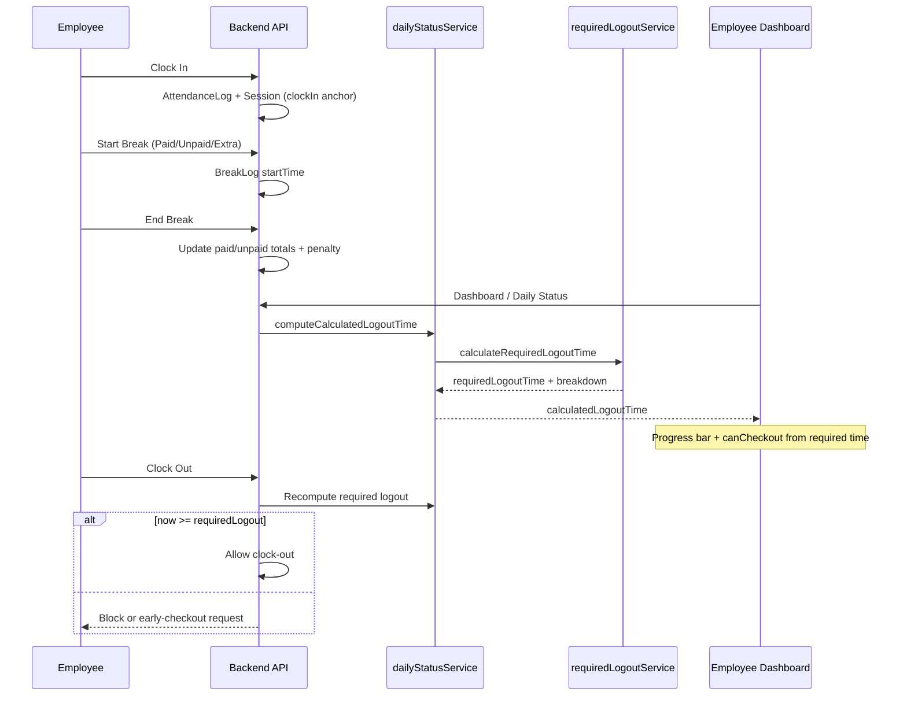

# Break Time Extension & Login/Logout — Technical Report

**Status:** Read-only analysis of current behavior (no code changes implied).  
**Last reviewed:** 2026-06-01

---

## 1. Executive summary

The attendance system treats a standard day as **9 hours on the clock** (540 minutes from first session start), including up to **30 minutes of paid break** inside that window. Breaks beyond policy **push required logout later**; they never allow earlier logout.

| Break type | Counted as | Extends required logout? | Allowance (policy) |
|------------|------------|--------------------------|---------------------|
| **Paid** | `paidBreakMinutesTaken` | Only minutes **above 30** | 30 min included in shift |
| **Unpaid** | `unpaidBreakMinutesTaken` | **All** minutes | 10 min for penalty reporting only |
| **Extra** | Same bucket as unpaid | **All** minutes (after admin approval) | 10 min for penalty reporting only |

**Authoritative calculation:** `backend/services/requiredLogoutService.js` → `calculateRequiredLogoutTime()`, invoked via `computeCalculatedLogoutTime()` in `backend/services/dailyStatusService.js`.

**UI:** `frontend/src/utils/shiftTimeCalculation.js` mirrors the math for progress/timer but **uses the backend’s `calculatedLogoutTime`** when present (7 PM floors, shift rules).

---

## 2. Policy constants

Defined in `backend/config/shiftPolicy.js`:

- **Shift total duration:** 540 min (9 h) — used in logout formula
- **Working time (attendance semantics):** 510 min (8.5 h) — used elsewhere (half-day, insufficient hours)
- **Paid break allowance:** 30 min
- **Unpaid / Extra allowance:** 10 min each — used only for **`penaltyMinutes`**, not for how much logout extends

---

## 3. Core formula (required logout time)

From `requiredLogoutService.js`:

```
excessPaidBreak = max(0, floor(totalPaidBreakMinutes) - 30)
totalExtension  = excessPaidBreak + floor(totalUnpaidBreakMinutes)

durationLogout  = clockInTime + 540 minutes + totalExtension

requiredLogout  = max(durationLogout, shiftBoundaryLogout, globalMinimum 7:00 PM IST)
```

**Interpretation:**

- First **30 min** of paid break does **not** extend logout (already inside the 9 h model).
- Every minute of **unpaid** or **extra** break extends logout by 1 minute.
- **Breaks only move logout later**, never earlier (also enforced by global 7 PM minimum where applicable).

---

## 4. Break types — behavior end-to-end

### 4.1 Paid break

**Start/end:** `POST /api/breaks/start` and `POST /api/breaks/end` (`backend/routes/breaks.js`).

On end:

- Full break duration is added to `AttendanceLog.paidBreakMinutesTaken`.
- If duration exceeds remaining allowance for that day, the overflow is also added to `penaltyMinutes` (reporting).
- Logout extension uses **total paid minutes** vs 30, not penalty alone.

### 4.2 Unpaid break

On end:

- Full duration goes to `unpaidBreakMinutesTaken`.
- Penalty applies only for minutes beyond **10** (`UNPAID_BREAK_ALLOWANCE_MINUTES`).
- **All** unpaid minutes extend required logout (not just excess over 10).

### 4.3 Extra break

- Employee must have an **approved, unused** `ExtraBreakRequest` for that day’s log.
- Starting Extra marks the request `isUsed: true`.
- On end, treated like unpaid: full duration → `unpaidBreakMinutesTaken`, penalty if > 10 min.
- In `computeCalculatedLogoutTime`, `Extra` is aggregated with `Unpaid` for logout math.

### 4.4 Prerequisites for any break

- Clocked in (`AttendanceLog` for today).
- Active work session (`AttendanceSession` with `endTime: null`).
- No other active break.
- Only one break at a time.

---

## 5. Data model (persistence)

**`AttendanceLog`** (`backend/models/AttendanceLog.js`):

- `clockInTime` / `clockOutTime` — day boundaries
- `paidBreakMinutesTaken`, `unpaidBreakMinutesTaken` — running totals (updated on break end)
- `penaltyMinutes` — over-allowance reporting
- `shiftDurationMinutes` — from shift group at clock-in

**`BreakLog`:** per break with `breakType` ∈ `Paid | Unpaid | Extra`, `startTime`, `endTime`, `durationMinutes`.

**Authoritative source for live logout:** `computeCalculatedLogoutTime` prefers summing **completed** breaks from the `breaks` array; includes **active** break duration in real time; falls back to log fields only if no break records exist.

---

## 6. Login (clock-in) and its effect on logout

**Route:** `POST /api/attendance/clock-in` (`backend/routes/attendance.js`).

Relevant behavior:

1. Creates `AttendanceLog` if missing (`clockInTime`, break counters at 0).
2. Creates `AttendanceSession` with `startTime = now`.
3. **First session start time** is the `clockInTime` anchor for required logout (also used for late/half-day logic).
4. Subsequent clock-ins same day add sessions but **do not reset** the first check-in for logout calculation.

Logout is always anchored to **first session `startTime`**, not latest clock-in.

---

## 7. Logout (clock-out) and enforcement

**Route:** `POST /api/attendance/clock-out`.

Flow:

1. Recompute `computeCalculatedLogoutTime(sessions, breaks, log, shift, activeBreak, approvedHalfDayLeave)`.
2. If `now < requiredLogoutTime` → **400** with `EARLY_CHECKOUT_APPROVAL_REQUIRED` (hard block).
3. Early exit path: `POST /api/attendance/early-checkout-request` (reason ≥ 25 chars) → admin approval.
4. Must end active break before clock-out.

**Dashboard** (`GET` employee dashboard in `attendance.js`):

- Exposes `requiredLogoutAt`, `canCheckout`, `remainingTime`.
- Toggle `enforceRequiredLogoutBeforeCheckout` can disable enforcement.
- Pending early-checkout request forces `canCheckout = false`.
- **Half-day leave:** recomputes logout with `approvedHalfDayLeave = true` for display; `requiredWorkMinutes` becomes 300.

**Frontend** (`EmployeeDashboardPage.jsx`):

- `getUnifiedShiftTimeState()` updates every second while clocked in/on break.
- `canCheckout` when `now >= requiredLogoutTime` (uses backend time when provided).
- `ShiftProgressBar` shows extension warnings when paid excess or unpaid time > 0.

---

## 8. Shift-specific logout floors (login time dependent)

Handled in `calculateRequiredLogoutTime` after duration-based time:

| Shift | Names | Login rule | Minimum logout behavior |
|-------|--------|------------|-------------------------|
| **General Shift 1** (10 AM) | `General Shift 1`, variants | Any check-in | **Hard 7:00 PM** floor (plus break extensions) |
| **General Shift 2** (11 AM) | `General Shift 2`, variants | Check-in **before 11:00 AM** | **7:00 PM** floor |
| | | Check-in **≥ 11:00 AM** | Duration only: `clockIn + 9h + extensions` (still subject to global 7 PM) |
| **Global** | All | — | `requiredLogout` never **before 19:00** on attendance date |

**Examples** (from `backend/test-shift-logic.js`):

- 10 AM shift, 10:00 login, 30 min paid → **7:00 PM** (floor wins over 6:30 PM duration).
- Same shift, 45 min paid → **7:15 PM** (15 min excess).
- 11 AM shift, 11:00 login, 30 min paid → **8:00 PM** (`11:00 + 9h`).
- 11 AM shift, 9:30 login → **7:00 PM** (early check-in floor).

---

## 9. Frontend unified time model

`frontend/src/utils/shiftTimeCalculation.js` documents and implements:

```
effectiveShiftDuration = 540 + max(0, paidTaken - 30) + floor(unpaidTaken)
requiredLogoutTime     = backend value OR clockIn + effectiveShiftDuration
progress               = elapsedShiftTime / effectiveShiftDuration
```

- **Elapsed** = wall clock since first session start (includes breaks).
- **Work time (display)** = elapsed − break time.
- Backend value wins so **7 PM policy** is not lost on the client.

---

## 10. End-to-end flow



---

## 11. Worked examples (extension only)

Assume General Shift 1, clock-in **10:00 AM**, 7 PM floor applies.

| Scenario | Paid | Unpaid/Extra | Extension | Required logout (typical) |
|----------|------|--------------|-----------|---------------------------|
| A: 25 min paid only | 25 | 0 | 0 | **7:00 PM** (floor) |
| B: 30 min paid | 30 | 0 | 0 | **7:00 PM** |
| C: 45 min paid | 45 | 0 | +15 | **7:15 PM** |
| D: 30 paid + 15 unpaid | 30 | 15 | +15 | **7:15 PM** |
| E: 20 paid + 20 unpaid | 20 | 20 | +20 | **7:20 PM** |
| F: 10 min extra (approved) | 0 | 10 | +10 | **7:10 PM** |

For **11 AM shift** with clock-in at **11:00**, duration leg is **8:00 PM** before adding break extensions.

---

## 12. Penalty vs shift extension

| Concept | Field / use | Affects logout? |
|---------|-------------|-----------------|
| **Shift extension** | `excessPaid` + all `unpaid` in `requiredLogoutService` | **Yes** |
| **Penalty** | `penaltyMinutes` on break end | **No** (analytics / reporting) |

Unpaid/Extra **10-minute allowances** only feed penalty, not “free” break before extension.

---

## 13. Related features (coupled but separate math)

- **Extra break request:** `POST /api/breaks/request-extra` → admin approval → one Extra break per day.
- **Break windows:** per-user `featurePermissions.breakWindows` — time-of-day eligibility only.
- **Admin log edits:** recalculate totals and logout via `computeCalculatedLogoutTime`.
- **Auto-break:** separate `BreakLog` path; must end before clock-out.
- **Insufficient hours / half-day:** separate policies from break extension formula.

---

## 14. Architecture layers

| Layer | Responsibility |
|-------|----------------|
| `shiftPolicy.js` | Static constants and shift name matching |
| `breaks.js` | Record breaks; increment log counters |
| `dailyStatusService.js` | Aggregate breaks + active break; call logout service |
| `requiredLogoutService.js` | Policy formula + 7 PM / shift floors |
| `shiftTimeCalculation.js` | UI sync, progress, warnings |
| `attendance.js` | Enforce logout at clock-out; dashboard flags |

---

## 15. Known observations

1. **`computeCalculatedLogoutTime`** sets `baseWorkMinutes` for half-day (300 vs 510) but **`calculateRequiredLogoutTime` always uses `SHIFT_TOTAL_MINUTES` (540)**. Half-day leave adjusts dashboard display via a separate recompute; confirm business intent if half-day should shorten required logout in the core service.
2. Comments in `dailyStatusService` mention “8.5 hours base”; implementation uses **9 hours (540)** in `requiredLogoutService`.
3. `SHIFT_11AM_CONFIG` description mentions “10 AM” in one comment; code uses **11:00 AM** as the boundary.
4. Frontend fallback (missing `backendRequiredLogoutTime`) uses simple `clockIn + effectiveShiftDuration` **without** 7 PM floors — normal flow always supplies backend value.

---

## 16. Key file reference

| Area | Path |
|------|------|
| Break API | `backend/routes/breaks.js` |
| Policy constants | `backend/config/shiftPolicy.js` |
| Logout calculation | `backend/services/requiredLogoutService.js` |
| Status aggregation | `backend/services/dailyStatusService.js` |
| Clock in/out | `backend/routes/attendance.js` |
| UI model | `frontend/src/utils/shiftTimeCalculation.js` |
| Dashboard UX | `frontend/src/pages/EmployeeDashboardPage.jsx`, `frontend/src/components/ShiftProgressBar.jsx` |
| Tests / examples | `backend/test-shift-logic.js` |
