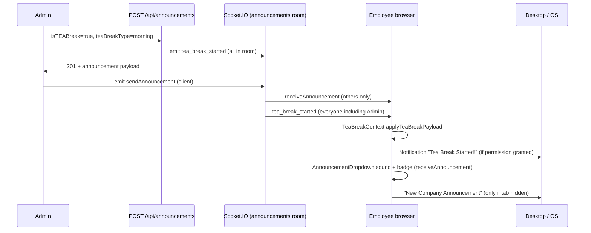

# Tea Break Desktop Notification — User-Side Diagnosis Report

**Status:** Read-only analysis (no code changes).  
**Date:** 2026-06-12  
**Scope:** Whether employees receive **desktop (browser/OS) notifications** when Admin/HR starts a morning or evening tea break.

---

## 1. Executive summary

| Question | Answer |
|----------|--------|
| Is a dedicated tea-break desktop notification implemented? | **Yes** — via `TeaBreakContext` on socket event `tea_break_started`. |
| Is it the same as the bell (in-app) notification drawer? | **No** — tea break does **not** create a `NewNotification` record; only a native browser `Notification`. |
| Will users always see a desktop popup when the tab is focused? | **Only if** browser permission is `granted` and the socket event is received. A **second** path (announcement dropdown) intentionally **suppresses** desktop popups when the tab is visible. |
| Is morning tea break treated differently from evening? | **No** — same code path; only the message label changes (`Morning` vs `Evening`). |

**Most likely reasons users report “no notification” while the break still works on the dashboard:**

1. Browser notification permission is `default` or `denied`.
2. Permission was granted **after** the prompt, but the tea-break hook still reads **stale React state** and skips showing the popup.
3. User expects the **megaphone / bell** UI, but tea break only uses the **OS notification** + dashboard timer (no in-app drawer entry).
4. User had the dashboard tab **focused** — they may have heard the announcement **sound** but did not get the **secondary** “New Company Announcement” popup (by design for that path).
5. Socket was disconnected at the moment Admin posted (state recovers via `GET /tea-break/active`, but **no retroactive desktop notification**).

---

## 2. How tea break notifications are supposed to work

### 2.1 End-to-end flow



### 2.2 Backend trigger

When Admin/HR posts with `isTEABreak: true`:

- **File:** `backend/routes/announcementRoutes.js`
- Persists `teaBreakStartedAt`, `teaBreakType` (`morning` | `evening`).
- Emits to Socket.IO room `announcements`:

```javascript
io.to('announcements').emit('tea_break_started', {
  announcementId,
  teaBreakStartedAt,
  teaBreakType,
  durationMinutes: 10,
});
```

All authenticated sockets join `announcements` on connect (`backend/socket.js`).

### 2.3 Frontend — primary desktop notification (tea break)

- **File:** `frontend/src/context/TeaBreakContext.jsx`
- **Provider scope:** Wraps the whole app inside `AuthProvider` (`App.jsx`).
- On `tea_break_started`:
  - Updates `teaBreakData` (powers dashboard “On Break” + timer).
  - Calls `showNotification('☕ Tea Break Started!', { body: 'Morning tea break — 10 minutes starting now.', ... })`.
- Does **not** use `onlyWhenHidden` — should attempt popup even when the tab is active (if permission allows).

### 2.4 Frontend — secondary signals (not tea-break-specific)

| Signal | Component | Desktop popup? | When |
|--------|-----------|----------------|------|
| Announcement sound | `AnnouncementDropdown.jsx` | No | On `receiveAnnouncement` from another user |
| Megaphone badge | `AnnouncementDropdown.jsx` | No | Unread announcement count |
| “New Company Announcement” | `AnnouncementDropdown.jsx` | Yes | Only when `document.visibilityState !== 'visible'` |
| Bell drawer item | `NewNotificationProvider` | Separate system | **Not used for tea break** |

Admin’s client also calls `socket.emit('sendAnnouncement', data)` after POST. That delivers the **text announcement** to other users, not the structured tea-break payload. Tea-break **timer state** depends on `tea_break_started`, not `receiveAnnouncement`.

---

## 3. What the user should see (checklist)

### 3.1 When notification works correctly

Logged-in employee, browser supports `Notification`, permission **granted**, socket connected:

1. **OS / browser toast:** title `☕ Tea Break Started!`, body e.g. `Morning tea break — 10 minutes starting now.`
2. **Sound** (if not muted): announcement chime from megaphone handler.
3. **Megaphone icon:** unread badge increment (if dropdown closed).
4. **Dashboard:** Status “On Break”, break timer (~10:00 countdown), without manual refresh.

### 3.2 When break works but desktop popup does not

| Symptom | Likely cause |
|---------|----------------|
| Timer + “On Break” appear, no OS toast | Permission denied/default, or stale permission state in hook |
| Nothing until refresh, then timer appears | Missed socket event; `GET /tea-break/active` restored state only (no backdated notification) |
| Sound + badge, no toast, tab was open | Expected for **announcement** popup path; **tea-break** popup should still fire if permission OK |
| No sound, no toast, no timer | Not logged in, socket offline, or tea break not posted as `isTEABreak` |

---

## 4. User-side diagnostic procedure (no code)

Perform these steps on an **employee** machine (e.g. Chrome/Edge on Windows).

### Step 1 — Browser permission

1. Open the app (e.g. `http://localhost:5173/dashboard`).
2. Click the **lock icon** in the address bar → **Site settings** → **Notifications**.
3. Expected: **Allow**. If **Block** or **Ask (default)**, desktop tea-break toasts will not appear reliably.

**Quick console check** (F12 → Console):

```javascript
Notification.permission  // should be "granted"
```

### Step 2 — OS-level settings (Windows)

- **Settings → System → Notifications** — ensure notifications are on for the browser.
- **Focus assist / Do not disturb** — can suppress toasts while still allowing in-app timer updates.

### Step 3 — Socket connectivity

F12 → Console, while logged in:

```javascript
// If socket is exposed via module graph, or watch Network → WS for /api/socket.io
```

Look for `[AuthContext] Socket.io connection initiated` in console.  
If disconnected during Admin post, user may miss `tea_break_started` (timer may still appear after navigation/refresh via REST).

### Step 4 — Live test with Admin

1. Employee: dashboard open, permission **granted**, console open.
2. Admin: post announcement with **“This is a Tea Break announcement”** + **Morning Break**.
3. Employee console — expect: `[Notification] Shown: ☕ Tea Break Started!`  
   If instead: `[Notification] Permission not granted` → permission issue confirmed.

### Step 5 — Distinguish notification types

| User says… | What to check |
|------------|----------------|
| “No notification” | OS toast vs megaphone vs bell — clarify which they expect |
| “I see the break timer” | Socket/REST OK; desktop path failed (permission/hook) |
| “Megaphone lit up but no popup” | Announcement popup hidden when tab focused; tea-break popup is separate |

---

## 5. Code-level findings (why desktop may fail)

### 5.1 Permission checked via React state (high impact)

**File:** `frontend/src/hooks/useDesktopNotification.js` (used by `TeaBreakContext`)

- `showNotification` gates on `permission !== 'granted'` from **React state**.
- `requestPermission()` runs on login and updates state asynchronously.
- If `tea_break_started` fires before state updates, or state is out of sync with `Notification.permission`, the hook logs `[Notification] Permission not granted` and returns `null` even when the browser has granted permission.

By contrast, `useDesktopNotifications.jsx` (bell drawer) reads `Notification.permission` **directly** at show time — more reliable.

### 5.2 No in-app notification record

Tea break does **not** call `NewNotificationService`. Users who watch only the **bell icon** will see **no new entry** for tea break. This is a product/UX gap, not a socket failure.

### 5.3 No notification on REST recovery

`TeaBreakContext` calls `GET /tea-break/active` on load and sets timer state, but **does not** call `showNotification`. Employees who reconnect after the event get UI state without a desktop toast.

### 5.4 Duplicate / competing socket usage

Multiple modules attach to the same socket singleton:

- `AuthContext` — connects when authenticated
- `TeaBreakContext` — connects if disconnected
- `NewNotificationProvider` — **disconnects on effect cleanup** when deps change

Under normal use this usually stabilizes, but reconnect windows can cause **missed** `tea_break_started` events (again: REST backfill without notification).

### 5.5 Admin vs employee

- **Admin** receives `tea_break_started` from server (included in `announcements` room).
- **Admin** does **not** receive own `receiveAnnouncement` (excluded by `socket.to('announcements')`).
- **Employees** receive both events.

### 5.6 Production service worker

`App.jsx` registers `/sw.js` only in **production**. SW is cache-focused, not push-based; unlikely to block notifications in dev (`localhost:5173`).

---

## 6. Notification matrix (employee desktop)

| Channel | Tea break morning | Visible tab | Permission required | Implemented |
|---------|-------------------|-------------|---------------------|-------------|
| OS toast “☕ Tea Break Started!” | Yes | Yes (intended) | Yes | Yes |
| OS toast “New Company Announcement” | Yes (same post) | **No** (`onlyWhenHidden`) | Yes | Yes |
| Announcement sound | Yes | Yes | No | Yes |
| Megaphone badge | Yes | Yes | No | Yes |
| Bell / `new_notification` drawer | No | — | — | **Not implemented** |
| Dashboard break timer | Yes | Yes | No | Yes |

---

## 7. Verdict

**Desktop tea-break notifications are implemented** and should appear for employees when:

1. They are logged in and the socket receives `tea_break_started`.
2. Browser `Notification.permission === 'granted'`.
3. OS notification settings do not block the browser.

**They are easy to miss or appear “broken” because:**

- There is **no bell-drawer notification** for tea break.
- The **announcement** desktop popup is **hidden when the tab is focused**, which users may confuse with tea-break behavior.
- The tea-break hook may **skip** showing a toast due to **stale permission state** even after the user allows notifications.
- **Reconnect / refresh** restores break UI via API but **never** sends a retroactive desktop notification.

---

## 8. Recommended follow-ups (documentation only — not implemented)

If product wants higher reliability (future work, not done in this report):

1. Use `Notification.permission` directly in `showNotification` (same pattern as `useDesktopNotifications.jsx`).
2. Optionally create a `NewNotification` entry for tea break so the bell icon matches user expectations.
3. On `GET /tea-break/active` with `active: true` after login, optionally show a one-time “Tea break in progress” toast if not locally dismissed.
4. Add structured client logging / telemetry: `tea_break_started` received, permission state, notification shown/skipped reason.

---

## 9. Key file reference

| Layer | File | Role |
|-------|------|------|
| Backend emit | `backend/routes/announcementRoutes.js` | `tea_break_started` payload |
| Socket rooms | `backend/socket.js` | Join `announcements` |
| Tea break state + desktop toast | `frontend/src/context/TeaBreakContext.jsx` | Primary user notification |
| Desktop hook (tea break) | `frontend/src/hooks/useDesktopNotification.js` | Permission + `new Notification()` |
| Announcement sound/badge | `frontend/src/components/AnnouncementDropdown.jsx` | Secondary; popup when tab hidden |
| Dashboard timer | `frontend/src/pages/EmployeeDashboardPage.jsx` | UI only, not a notification |
| Active break API | `backend/routes/teaBreakRoutes.js` | `GET /tea-break/active` recovery |

---

## 10. Quick answer for stakeholders

> **Are tea break desktop notifications coming to users?**  
> **Conditionally yes.** The system sends a dedicated `☕ Tea Break Started!` browser notification over Socket.IO. Many users will still perceive “no notification” because bell-drawer alerts are not used, announcement popups are suppressed while the tab is open, or browser/OS permission blocks native toasts. The break **feature** (timer on dashboard) can work even when the **desktop toast** does not.
